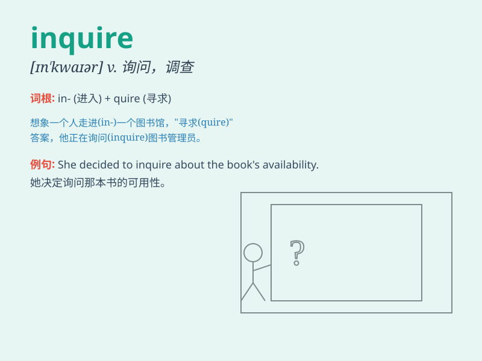

## inquire

**英音:** _[ɪn\'kwaɪə]_ **美音:** _[ɪn\'kwaɪr]_

**译义:** *v.询问,问明,查究*

### 短语

+ **inquire into:** _调查；探究_

+ **inquire about:** _询问；打听_

+ **inquire after:** _问候；问安_

+ **inquire of:** _向\...打听_

+ **inquire closely:** _仔细询问_

### 例句

#### 例句1

> **I will inquire about the train schedule at the station.**

**中文翻译:** 我会询问车站的火车时刻表。

**单词释义:** 询问

#### 例句2

> **The police are inquiring into the cause of the accident.**

**中文翻译:** 警方正在调查事故原因。

**单词释义:** 调查

#### 例句3

> **She inquired whether I needed help.**

**中文翻译:** 她询问我是否需要帮助。

**单词释义:** 询问

### 背诵小故事

> A detective was trying to solve a mystery. He kept inquiring everyone
he met for clues. \'Inquire\' means to ask for information, just like
the detective was doing to get to the truth.

**一位侦探试图解开一个谜团。他不断向他遇到的每个人询问线索。\'inquire\'的意思是询问信息，就像这位侦探所做的那样以获取真相。**

### 图义

