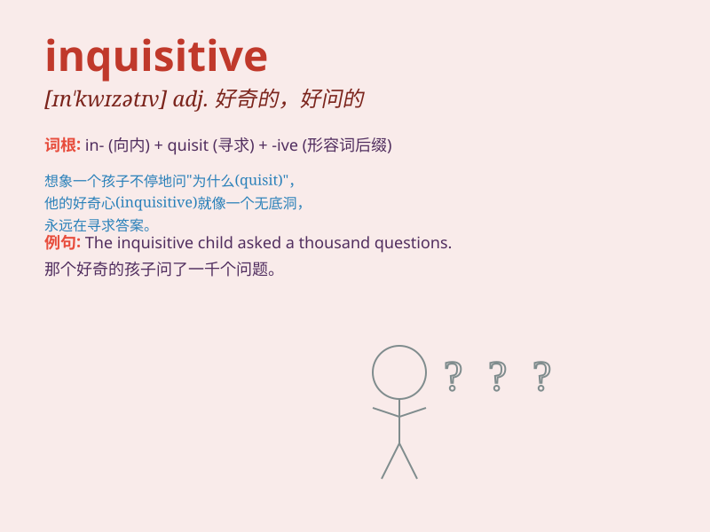

## inquisitive

**英音:** _[ɪn\'kwɪzɪtɪv]_ **美音:** _[ɪn\'kwɪzətɪv]_

**译义:** *adj.好奇的*

### 短语

+ **be inquisitive about:** _对\...\...好奇_

+ **inquisitive mind:** _好奇的头脑_

+ **inquisitive look:** _好奇的表情_

+ **inquisitive nature:** _好奇的天性_

+ **an inquisitive child:** _一个好奇的孩子_

### 例句

#### 例句1

> **The inquisitive child kept asking questions about the stars.**

**中文翻译:** 好奇的孩子不停地问关于星星的问题。

**单词释义:** 好奇的

#### 例句2

> **She has an inquisitive mind and is always seeking knowledge.**

**中文翻译:** 她有一颗好奇心，总是在寻求知识。

**单词释义:** 好奇的；爱打听的

#### 例句3

> **His inquisitive nature led him to explore uncharted
territories.**

**中文翻译:** 他的好奇心促使他探索未知领域。

**单词释义:** 好奇的；好问的

### 背诵小故事

> Once upon a time, there was an inquisitive little monkey. It was
always curious about everything around it, constantly asking questions
and exploring. This monkey\'s inquisitive nature made it learn a lot.

**从前，有一只好奇的小猴子。它总是对周围的一切感到好奇，不断地提问和探索。这只猴子的好奇天性让它学到了很多。**

### 图义

