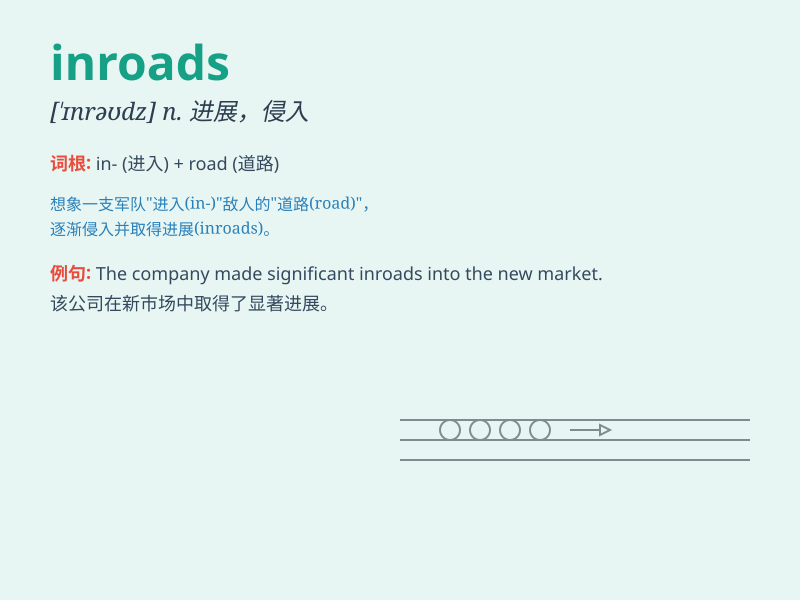

## inroads

**英音:** _[ˈɪnrəʊdz]_ **美音:** _[ˈɪnrəʊdz]_

**译义:** *n. 侵入，渗透；进展，进步（常用于 make inroads into
表示在某方面取得进展）*

### 短语

+ **make inroads:** _取得进展；侵占_

+ **inroads into:** _对\...\...的侵入；对\...\...的侵蚀_

+ **inroads on:** _侵犯；损害_

+ **significant inroads:** _重大进展_

+ **initial inroads:** _初步进展_

### 例句

#### 例句1

> **The new company is making inroads into the international
market.**

**中文翻译:** 这家新公司正在进军国际市场。

**单词释义:** 进展；侵入

#### 例句2

> **The disease has made inroads on his health.**

**中文翻译:** 疾病损害了他的健康。

**单词释义:** 损害；侵蚀

#### 例句3

> **Our team has made significant inroads in solving the problem.**

**中文翻译:** 我们团队在解决这个问题上取得了重大进展。

**单词释义:** 进展；突破

### 背诵小故事

>
想象一下，敌军在深夜悄悄潜入我方领土，他们的行动逐渐对我方防线造成了影响，这就是\'inroads\'。就像敌军的入侵，这个词表示侵犯、损害。

**想象敌军的潜入对我方造成影响来记\'inroads\'，表示侵犯、损害**

### 图义

