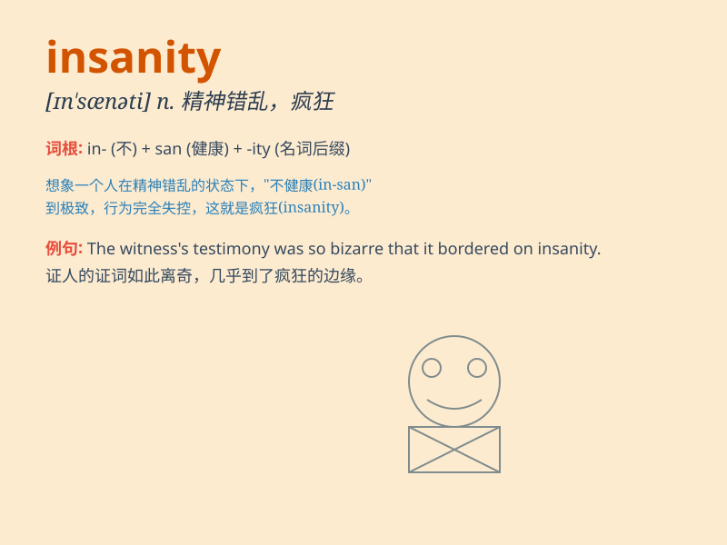

## insanity

**英音:** _[ɪn\'sænətɪ]_ **美音:** _[ɪn\'sænəti]_

**译义:** *n.精神错乱,疯狂,愚顽*

### 短语

+ **commit insanity:** _做出疯狂的举动_

+ **moment of insanity:** _疯狂的时刻_

+ **driven to insanity:** _被逼疯_

+ **verge of insanity:** _处于疯狂的边缘_

+ **descend into insanity:** _陷入疯狂_

### 例句

#### 例句1

> **The defendant\'s claim of temporary insanity was not accepted by
the jury.**

**中文翻译:** 陪审团不接受被告暂时精神错乱的主张。

**单词释义:** 精神失常；精神错乱

#### 例句2

> **His actions bordered on insanity.**

**中文翻译:** 他的行为近乎疯狂。

**单词释义:** 疯狂；荒谬

#### 例句3

> **The stress of the job drove her to the brink of insanity.**

**中文翻译:** 工作的压力让她几近疯狂。

**单词释义:** 精神错乱；精神失常

### 背诵小故事

> A man was constantly hearing strange voices in his head. Everyone
thought he was crazy. This behavior shows the state of insanity.
Eventually, he needed professional help.

**一个男人不断地在脑海中听到奇怪的声音。大家都认为他疯了。这种行为展现了精神错乱的状态。最终，他需要专业帮助。**

### 图义

