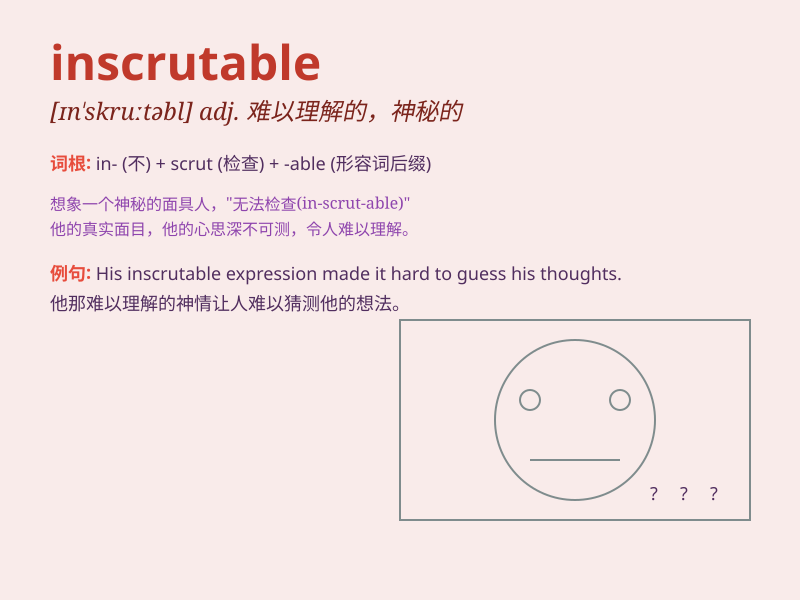

## inscrutable

**英音:** _[ɪn\'skruːtəb(ə)l]_ **美音:**
_[ɪn\'skrʊtəbl]_

**译义:** *adj.难以了解的,不能预测的*

### 短语

+ **an inscrutable expression:** _难以捉摸的表情_

+ **inscrutable mystery:** _难以理解的谜团_

+ **inscrutable look:** _神秘莫测的神情_

+ **inscrutable smile:** _高深莫测的微笑_

+ **inscrutable behavior:** _令人费解的行为_

### 例句

#### 例句1

> **His expression remained inscrutable as he listened to the bad
news.**

**中文翻译:** 当他听到这个坏消息时，他的表情仍然难以捉摸。

**单词释义:** 难以捉摸的；神秘莫测的

#### 例句2

> **The motives of the politician were inscrutable to the public.**

**中文翻译:** 这位政客的动机对于公众来说是难以理解的。

**单词释义:** 难以理解的；神秘的

#### 例句3

> **She gave him an inscrutable look and walked away.**

**中文翻译:** 她不可思议地看了他一眼，然后走开了。

**单词释义:** 难以解读的；费解的

### 背诵小故事

> A detective was trying to solve a mysterious case. The suspect had an
inscrutable expression, making it impossible for the detective to figure
out his thoughts. Just like this face, inscrutable means impossible to
understand or interpret.

**一位侦探试图侦破一起神秘案件。嫌疑人有着难以捉摸的表情，让侦探无法弄清楚他的想法。就像这表情一样，inscrutable
意思是难以理解或解释的。**

### 图义

