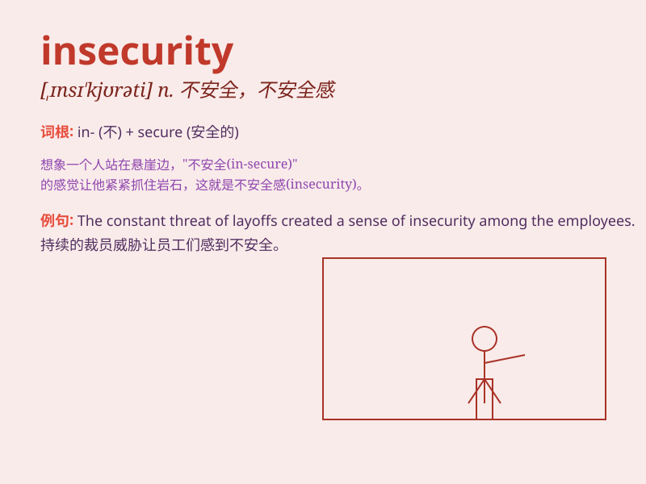

## insecurity

**英音:** _[ˌɪnsɪ\'kjʊərətɪ]_ **美音:**
_[ˌɪnsɪˈkjʊrətɪ]_

**译义:** *n.不安全,不安全感*

### 短语

+ **sense of insecurity:** _不安全感_

+ **emotional insecurity:** _情绪上的不安_

+ **economic insecurity:** _经济上的不安全感_

+ **personal insecurity:** _个人的不安全感_

+ **job insecurity:** _工作不稳定；工作缺乏保障_

### 例句

#### 例句1

> **Her constant insecurity made it difficult for her to form lasting
relationships.**

**中文翻译:** 她持续的不安全感使她很难建立持久的关系。

**单词释义:** 不安全感

#### 例句2

> **The country\'s economic insecurity has led to widespread
unemployment.**

**中文翻译:** 该国的经济不安全导致了广泛的失业。

**单词释义:** 不稳定；不安全

#### 例句3

> **He tried to hide his insecurity behind a mask of confidence.**

**中文翻译:** 他试图用自信的面具来掩饰自己的不安全感。

**单词释义:** 不安全感

### 背诵小故事

> A little rabbit always felt insecurity when going out alone. It
worried about getting lost or meeting dangerous animals. But one day, it
bravely faced its fears and found that the world wasn\'t so scary. The
feeling of insecurity vanished.

**一只小兔子独自外出时总是感到不安。它担心迷路或遇到危险的动物。但有一天，它勇敢地面对恐惧，发现世界并没有那么可怕。不安的感觉消失了。**

### 图义

