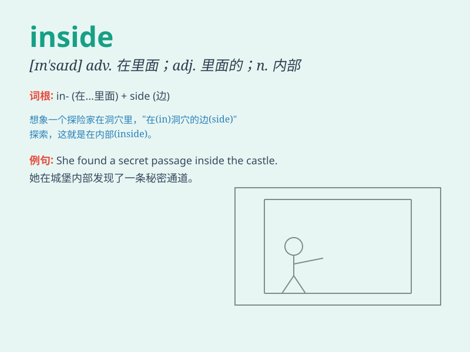

## inside

**英音:** _[ɪn\'saɪd]_ **美音:** _[\'ɪn\'saɪd]_

**译义:**
*n.里面,内部,内脏,内情adj.内部的,秘密的,于室内工作的adv.在里面
prep.在\...之内*

### 短语

+ **inside out:** _彻底地；里面翻到外面_

+ **inside job:** _内部人作案；内勤；内贼作案_

+ **inside information:** _内幕消息；内部情报_

+ **inside track:** _有利地位；内圈跑道；占上风_

+ **on the inside:** _在里面；知道内情；处于内部_

### 例句

#### 例句1

> **The cat is inside the box.**

**中文翻译:** 猫在盒子里。

**单词释义:** 在\...\...里面

#### 例句2

> **He knows the truth inside out.**

**中文翻译:** 他从里到外都知道真相。

**单词释义:** 彻底地；完全地

#### 例句3

> **There is a small pocket inside the jacket.**

**中文翻译:** 夹克内部有一个小口袋。

**单词释义:** 在\...\...里面

### 背诵小故事

> A little mouse was lost. It searched everywhere and finally found a
warm place. It was inside a big box filled with soft cotton. The mouse
felt safe and happy.

**一只小老鼠迷路了。它到处找，最后发现了一个温暖的地方。它在一个装满柔软棉花的大盒子里面。小老鼠感到安全又开心。**

### 图义

