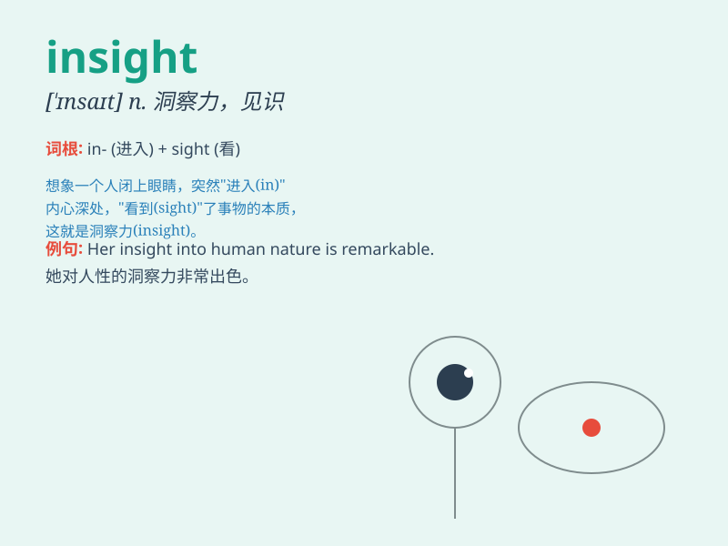

## insight

**英音:** _[\'ɪnsaɪt]_ **美音:** _[\'ɪn\'saɪt]_

**译义:** *n.洞察力,见识*

### 短语

+ **gain insight:** _获得洞察力；有更深入的了解_

+ **deep insight:** _深刻的见解_

+ **provide insight:** _提供见解_

+ **unique insight:** _独特的见解_

+ **insight into:** _对\...\...的洞察_

### 例句

#### 例句1

> **The book provided valuable insights into the history of art.**

**中文翻译:** 这本书提供了对艺术史的宝贵见解。

**单词释义:** 深刻的见解；洞察力

#### 例句2

> **She had an insight that solved the problem.**

**中文翻译:** 她的洞察力解决了这个问题。

**单词释义:** 洞察力；顿悟

#### 例句3

> **His work offers new insights into the field of psychology.**

**中文翻译:** 他的工作为心理学领域提供了新的见解。

**单词释义:** 见解；看法

### 背诵小故事

> One day, while lost in a dark forest, I suddenly had an insight. I
saw a light in the distance and realized it was the way out. This moment
of clear understanding and perception saved me.

**有一天，当我在黑暗的森林中迷路时，我突然有了洞察力。我看到远处有一束光，并意识到那是出路。这种清晰的理解和感知的时刻救了我。**

### 图义

