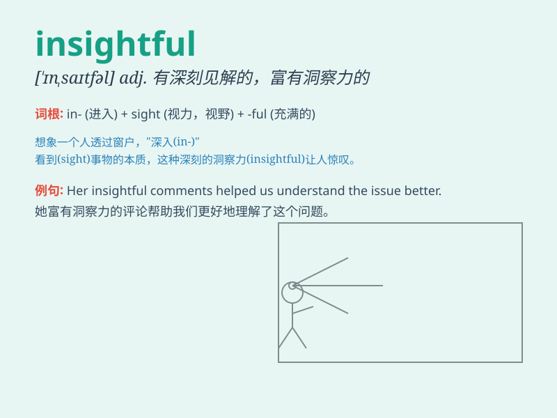

## insightful

**英音:** _[\'ɪnsaɪtf(ʊ)l]_ **美音:** _[\'ɪnsaɪtfəl]_

**译义:** *adj.富有洞察力的,有深刻见解的*

### 短语

+ **insightful comment:** _有见地的评论_

+ **insightful analysis:** _深刻的分析_

+ **insightful perspective:** _富有洞察力的观点_

+ **insightful understanding:** _深刻的理解_

+ **insightful observation:** _有洞察力的观察_

### 例句

#### 例句1

> **The book offers insightful perspectives on history.**

**中文翻译:** 该书提供了对历史的深刻见解。

**单词释义:** 富有洞察力的，有深刻见解的

#### 例句2

> **Her insightful comments helped us solve the problem.**

**中文翻译:** 她富有洞察力的评论帮助我们解决了问题。

**单词释义:** 富有洞察力的，有深刻见解的

#### 例句3

> **The professor gave an insightful lecture on literature.**

**中文翻译:** 教授对文学做了一次富有洞察力的讲座。

**单词释义:** 富有洞察力的，有深刻见解的

### 背诵小故事

> One day, Tom was lost in a forest. But a wise old man gave him
insightful advice. With that, Tom found the way out. The old man\'s
words were like a light, showing Tom the truth clearly.

**有一天，汤姆在森林里迷路了。但一位睿智的老人给了他富有洞察力的建议。凭借这个，汤姆找到了出路。老人的话就像一盏明灯，清晰地向汤姆揭示了真相。**

### 图义

