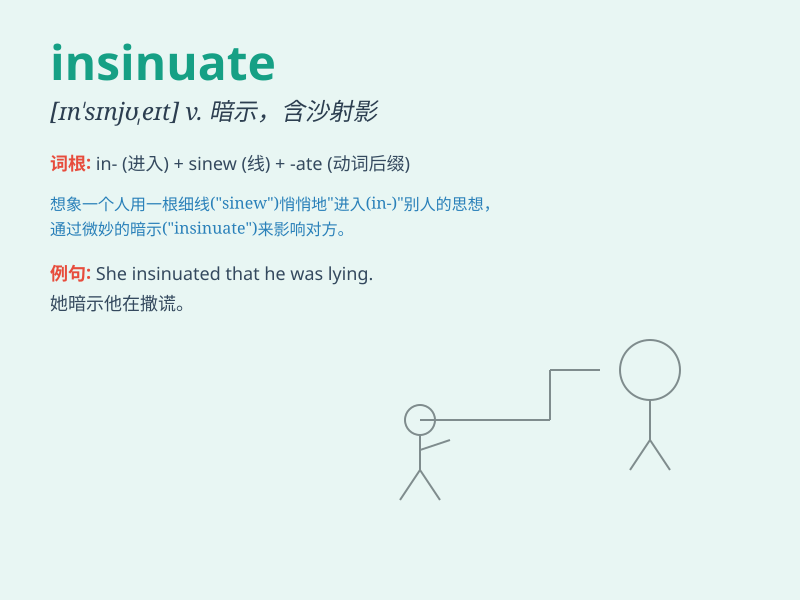

## insinuate

**英音:** _[ɪn\'sɪnjʊeɪt]_ **美音:** _[ɪn\'sɪnjuet]_

**译义:**
*vt.使逐步而巧妙地取得,使迂回地潜入(或挤入),使慢慢滋长,含沙射影地说*

### 短语

+ **insinuate oneself:** _巧妙地进入；逐渐取得信任_

+ **insinuate something into:** _把某物逐渐灌输到_

+ **insinuate doubt:** _暗示怀疑_

+ **insinuate a compliment:** _暗示赞美_

+ **insinuate a threat:** _暗示威胁_

### 例句

#### 例句1

> **He insinuated that I was lying.**

**中文翻译:** 他暗示我在撒谎。

**单词释义:** 暗示

#### 例句2

> **She insinuated herself into the group by being overly
friendly.**

**中文翻译:** 她通过过于友好的方式融入了这个团体。

**单词释义:** 巧妙地进入；逐渐而巧妙地获得

#### 例句3

> **The article insinuated that the politician was corrupt.**

**中文翻译:** 这篇文章暗示这位政客腐败。

**单词释义:** 暗示

### 背诵小故事

> A sly fox wanted to enter the chicken coop. Instead of forcing its
way in, it insinuated itself by slowly and quietly approaching the
entrance, making the chickens believe it was friendly. But its true
intention was to catch them.

**一只狡猾的狐狸想进入鸡舍。它没有强行闯入，而是通过慢慢地、悄悄地靠近入口来暗示自己，让鸡相信它是友好的。但它的真正意图是抓住它们。**

### 图义

