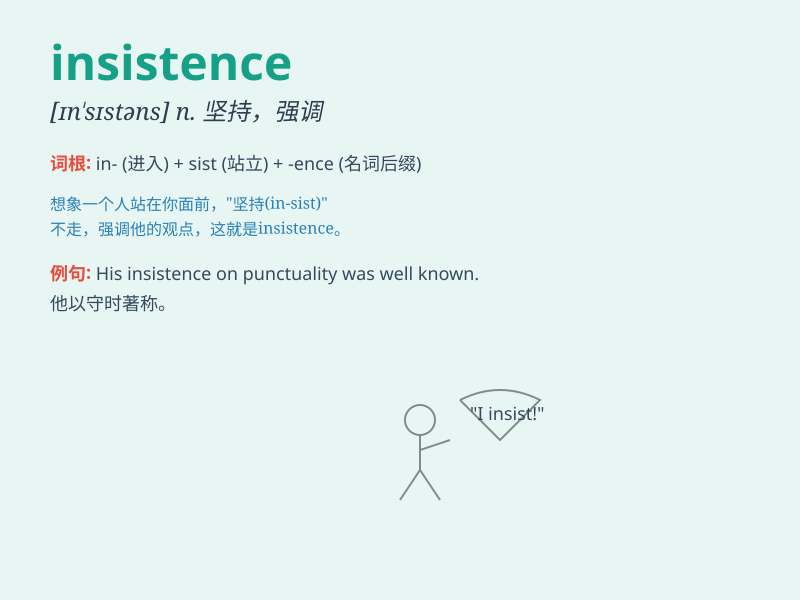

## insistence

**英音:** _[ɪnˈsɪstəns]_ **美音:** _[ɪnˈsɪstəns]_

**译义:** *n.坚持,坚决主张*

### 短语

+ **insistence on:** _坚持；坚决主张_

+ **strong insistence:** _强烈坚持_

+ **constant insistence:** _持续的坚持_

+ **unwavering insistence:** _坚定不移的坚持_

+ **stubborn insistence:** _顽固的坚持_

### 例句

#### 例句1

> **Despite my objections, her insistence on going alone remained
firm.**

**中文翻译:** 尽管我反对，她还是坚持独自前往。

**单词释义:** 坚持

#### 例句2

> **His insistence that he was innocent finally convinced the
jury.**

**中文翻译:** 他坚称自己无罪最终说服了陪审团。

**单词释义:** 坚决主张

#### 例句3

> **I gave in to her insistence and agreed to help.**

**中文翻译:** 我屈服于她的坚持并同意提供帮助。

**单词释义:** 坚持要求

### 背诵小故事

> A poor student wanted to drop out of school. But his teacher\'s
insistence made him stay. The teacher insisted that with hard work, he
could succeed. Finally, the student did well. Insistence means the act
of insisting firmly.

**一个贫困的学生想要辍学。但他老师的坚决主张让他留了下来。老师坚决认为只要努力，他就能成功。最后，这个学生表现出色。Insistence
意思是坚决主张，坚决要求的行为。**

### 图义

