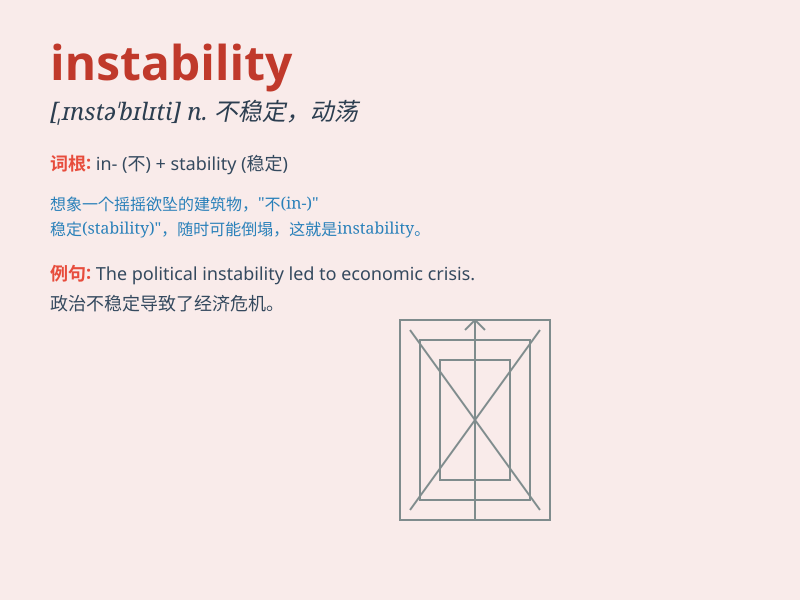

## instability

**英音:** _[ɪnstə\'bɪlɪtɪ]_ **美音:** _[,ɪnstə\'bɪləti]_

**译义:** *n.不稳定(性)*

### 短语

+ **political instability:** _政治不稳定_

+ **economic instability:** _经济不稳定_

+ **emotional instability:** _情绪不稳定_

+ **structural instability:** _结构不稳定_

+ **regional instability:** _地区不稳定_

### 例句

#### 例句1

> **The political instability has led to economic decline.**

**中文翻译:** 政治不稳定导致经济衰退。

**单词释义:** 不稳定；不稳固

#### 例句2

> **The instability of the market makes investors cautious.**

**中文翻译:** 市场的不稳定使投资者谨慎行事。

**单词释义:** 不稳定；易变

#### 例句3

> **His emotional instability often causes problems in his
relationships.**

**中文翻译:** 他的情绪不稳定常常导致他的人际关系出现问题。

**单词释义:** 不稳定；无常

### 背诵小故事

> In a small village, the weather showed instability. One day was
sunny, the next was stormy. This made the farmers very worried as they
couldn\'t plan their crops. The constant changes symbolized the meaning
of \'instability\'.

**在一个小村庄，天气表现出不稳定性。一天是晴天，第二天是暴风雨。这让农民们非常担心，因为他们无法规划农作物。这种不断的变化象征着\'不稳定性\'的含义。**

### 图义

