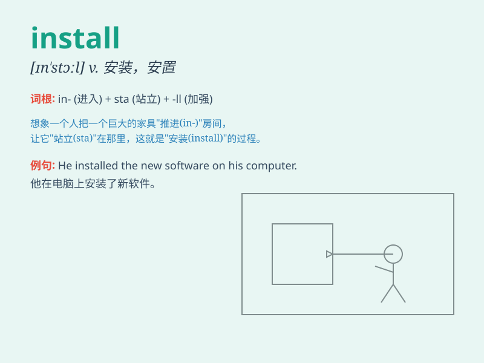

## install

**英音:** _[ɪnˈstɔ:l]_ **美音:** _[ɪn\'stɔl]_

**译义:** *vt.安装,安置,使就职*

### 短语

+ **install software:** _安装软件_

+ **install equipment:** _安装设备_

+ **install a system:** _安装一个系统_

+ **install a security camera:** _安装一个安全摄像头_

+ **install a heating system:** _安装一个供暖系统_

### 例句

#### 例句1

> **We are going to install a new air conditioning system in the
office.**

**中文翻译:** 我们将在办公室安装新的空调系统。

**单词释义:** 安装

#### 例句2

> **The software was easy to install on my computer.**

**中文翻译:** 该软件很容易安装在我的计算机上。

**单词释义:** 安装

#### 例句3

> **He was hired to install security cameras in the building.**

**中文翻译:** 他受雇在大楼内安装安全摄像头。

**单词释义:** 安装

### 背诵小故事

>
想象你有一个全新的智能机器人，你把它带回家，然后按照复杂的说明书一步步操作，最终成功将它的程序和组件'install'（安装）好，它开始为你服务啦。

**想象你有一个新的智能机器人，你把它带回家然后按照说明书一步步操作，最终成功将它的程序和组件'安装'好，它开始为你服务。**

### 图义

