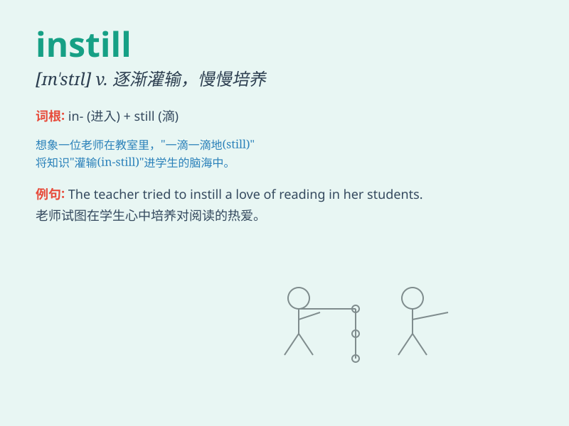

## instill

**英音:** _[ɪnˈstɪl]_ **美音:** _[ɪnˈstɪl]_

**译义:** *vt.慢慢地灌输*

### 短语

+ **instill confidence:** _灌输信心_

+ **instill knowledge:** _传授知识_

+ **instill values:** _灌输价值观_

+ **instill a sense of:** _逐步培养某种感觉_

+ **instill discipline:** _培养纪律性_

### 例句

#### 例句1

> **The teacher tried to instill a love of reading in her
students.**

**中文翻译:** 老师试图向她的学生灌输对阅读的热爱。

**单词释义:** 逐渐灌输；逐步培养

#### 例句2

> **Parents should instill good values in their children from a young
age.**

**中文翻译:** 父母应该从小就向孩子灌输良好的价值观。

**单词释义:** 逐渐灌输；逐步培养

#### 例句3

> **The coach instilled confidence in the team before the game.**

**中文翻译:** 教练在赛前向球队灌输了信心。

**单词释义:** 逐步注入；逐渐培养

### 背诵小故事

> Imagine a wise old wizard instilling magical knowledge and courage
into a young apprentice. The wizard carefully pours the wisdom, just
like instilling liquid drop by drop. The apprentice absorbs it all,
growing stronger.

**想象一位睿智的老巫师将神奇的知识和勇气灌输到年轻学徒的头脑中。巫师小心翼翼地倾注智慧，就像一滴一滴地灌输液体。学徒全盘吸收，变得更强。**

### 图义

