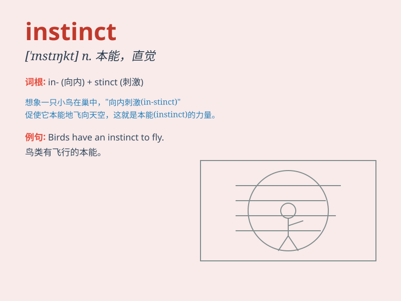

## instinct

**英音:** _[\'ɪnstɪŋ(k)t]_ **美音:** _[\'ɪnstɪŋkt]_

**译义:** *n.本能*

### 短语

+ **animal instinct:** _动物本能_

+ **by instinct:** _出于本能_

+ **instinct for survival:** _生存本能_

+ **instinctive reaction:** _本能反应_

+ **trust one\'s instinct:** _相信自己的直觉_

### 例句

#### 例句1

> **Birds have an instinct to build nests.**

**中文翻译:** 鸟类有筑巢的本能。

**单词释义:** 本能

#### 例句2

> **It\'s instinct that makes a mother protect her child.**

**中文翻译:** 这是母亲保护孩子的本能。

**单词释义:** 本能

#### 例句3

> **He followed his instinct and found the lost key.**

**中文翻译:** 他凭着直觉找到了丢失的钥匙。

**单词释义:** 直觉

### 背诵小故事

> A little bird was lost in the forest. Without any guidance, it flew
south for the winter. This was its instinct. It knew exactly what to do
without being taught. Just like the bird, instinct is an inborn ability
to know and do things.

**一只小鸟在森林里迷路了。没有任何指引，它就飞往南方过冬。这是它的本能。它不用被教导就确切知道该怎么做。就像这只鸟一样，本能是一种天生就知道和做事情的能力。**

### 图义

