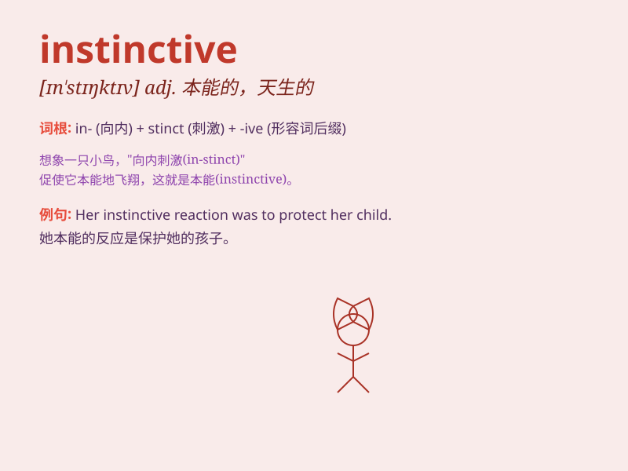

## instinctive

**英音:** _[ɪn\'stɪŋ(k)tɪv]_ **美音:** _[ɪn\'stɪŋktɪv]_

**译义:** *adj.本能的*

### 短语

+ **instinctive reaction:** _本能反应_

+ **instinctive behavior:** _本能行为_

+ **instinctive fear:** _本能的恐惧_

+ **instinctive drive:** _本能的冲动_

+ **instinctive response:** _本能的回应_

### 例句

#### 例句1

> **His instinctive reaction was to run away when he saw the
snake.**

**中文翻译:** 当他看到蛇时，他的本能反应是逃跑。

**单词释义:** 本能的

#### 例句2

> **She has an instinctive ability to understand people\'s
emotions.**

**中文翻译:** 她有一种本能的能力，能够理解人们的情绪。

**单词释义:** 本能的

#### 例句3

> **The dog\'s instinctive behavior is to protect its owner.**

**中文翻译:** 狗的本能行为是保护主人。

**单词释义:** 本能的

### 背诵小故事

> A little monkey was lost in the forest. Without thinking, it climbed
up a tree instinctively to avoid danger. It knew how to do this from its
inner nature. That\'s what instinctive means - acting without conscious
thought.

**一只小猴子在森林里迷路了。它不假思索，本能地爬上一棵树来躲避危险。它从内心就知道这么做。这就是"instinctive（本能的）"的意思------未经有意识思考而做出的行动。**

### 图义

