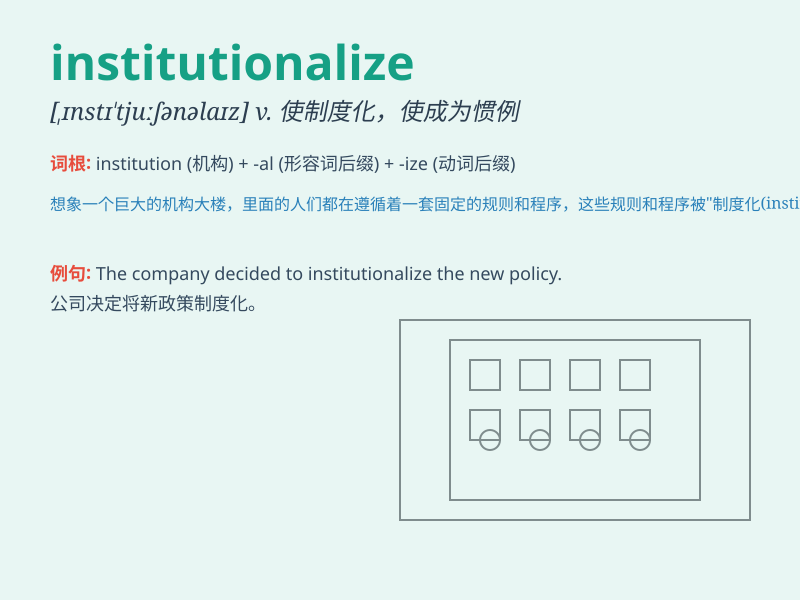

## institutionalize

**英音:** _[ˌɪnstɪˈtjuːʃənəlaɪz]_ **美音:**
_[ˌɪnstɪˈtuːʃənəlaɪz]_

**译义:** *vt.使制度化或习俗化；使送进专门机构；使成惯例*

### 短语

+ **institutionalize care:** _使照料制度化_

+ **institutionalize reforms:** _使改革制度化_

+ **institutionalize practices:** _使做法制度化_

+ **institutionalize a process:** _使一个过程制度化_

+ **institutionalize standards:** _使标准制度化_

### 例句

#### 例句1

> **The government plans to institutionalize the new welfare program
to ensure its long-term stability.**

**中文翻译:** 政府计划将新的福利项目制度化，以确保其长期稳定。

**单词释义:** 使制度化

#### 例句2

> **She was institutionalized after a severe mental breakdown.**

**中文翻译:** 她在严重精神崩溃后被送进了精神病院。

**单词释义:** 把...送进收容机构

#### 例句3

> **The company has institutionalized a system of regular performance
reviews.**

**中文翻译:** 该公司已经使定期绩效评估制度制度化。

**单词释义:** 使成为惯例

### 背诵小故事

> A little monkey was always causing trouble. So, the zoo decided to
institutionalize it, meaning they put it in a special place with rules
and systems to control its behavior.

**一只小猴子总是惹麻烦。所以，动物园决定把它收容安置，意思是把它安置在一个有规则和制度来控制其行为的特殊地方。**

### 图义

