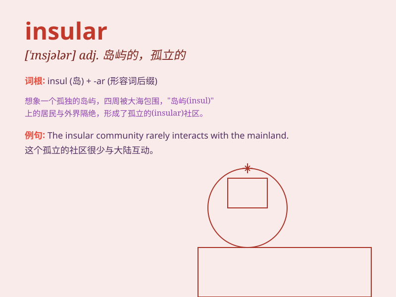

## insular

**英音:** _[\'ɪnsjʊlə]_ **美音:** _[\'ɪnsəlɚ]_

**译义:** *adj.海岛的,岛民的,岛特有的,孤立的,超然物外的*

### 短语

+ **insular mentality:** _狭隘的心态_

+ **insular region:** _岛屿地区_

+ **insular prejudice:** _孤立的偏见_

+ **insular community:** _与世隔绝的社区_

+ **insular culture:** _封闭的文化_

### 例句

#### 例句1

> **The insular villagers were reluctant to interact with
outsiders.**

**中文翻译:** 与世隔绝的村民不愿意与外人交往。

**单词释义:** 与世隔绝的

#### 例句2

> **His insular attitude made it difficult for him to adapt to new
situations.**

**中文翻译:** 他的孤立态度使他很难适应新的环境。

**单词释义:** 狭隘的

#### 例句3

> **The company has an insular management style that hinders
innovation.**

**中文翻译:** 该公司的管理风格孤立，阻碍了创新。

**单词释义:** 保守的

### 背诵小故事

>
想象一个小岛，岛上的居民很少与外界交流，他们的思想很狭隘，生活方式也很保守。这个小岛就是
insular 的象征，意味着孤立、狭隘。

**想象一个小岛居民孤立、狭隘的情景来辅助记忆'insular'这个单词，意思是孤立的、狭隘的。**

### 图义

