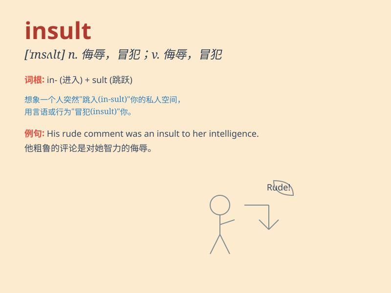

## insult

**英音:** _[ɪn\'sʌlt]_ **美音:** _[ɪn\'sʌlt]_

**译义:** *n.侮辱,凌辱vt.侮辱,凌辱*

### 短语

+ **add insult to injury:** _雪上加霜；往伤口上撒盐_

+ **insult someone\'s intelligence:**
_侮辱某人的智力；把某人当傻瓜_

+ **heap insults on:** _大肆侮辱_

+ **bear an insult:** _忍受侮辱_

+ **offer an insult:** _进行侮辱_

### 例句

#### 例句1

> **He insulted her by calling her names.**

**中文翻译:** 他辱骂她，侮辱她。

**单词释义:** 侮辱；辱骂

#### 例句2

> **I felt insulted when they ignored my suggestion.**

**中文翻译:** 当他们忽视我的建议时，我感到受到了侮辱。

**单词释义:** 使感到受侮辱

#### 例句3

> **It was a deliberate insult to his dignity.**

**中文翻译:** 这是对他尊严的故意侮辱。

**单词释义:** 侮辱；冒犯

### 背诵小故事

> A man was walking on the street. Suddenly, another person came up and
said some very mean words to him. Those mean words were an insult. The
man felt hurt and angry.

**一个男人正在街上走着。突然，另一个人走过来对他说了一些非常刻薄的话。那些刻薄的话就是侮辱。这个男人感到受伤和生气。**

### 图义

