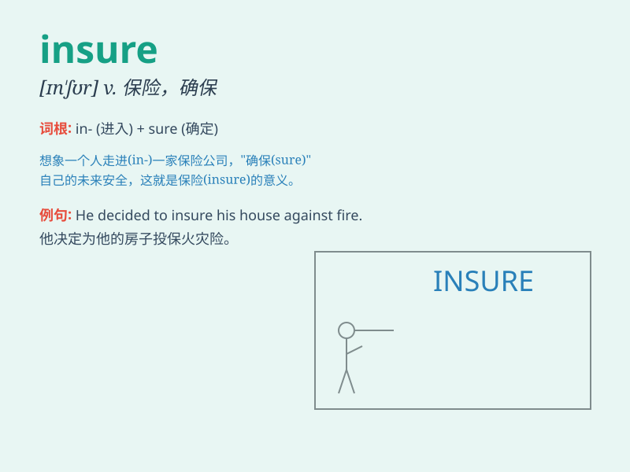

## insure

**英音:** _[ɪn\'ʃɔː; ɪn\'ʃʊə]_ **美音:** _[ɪn\'ʃʊr]_

**译义:** *vt.给\...保险v.确保*

### 短语

+ **insure against:** _为\...投保以防_

+ **insure for:** _投保\...金额_

+ **insure oneself:** _给自己保险_

+ **insure success:** _保证成功_

+ **insure safety:** _确保安全_

### 例句

#### 例句1

> **I want to insure my car against theft.**

**中文翻译:** 我想给我的汽车投保以防被盗。

**单词释义:** 给\...投保

#### 例句2

> **His life was insured for one million dollars.**

**中文翻译:** 他的生命投保了一百万美元。

**单词释义:** 投保

#### 例句3

> **The company will insure you against injury at work.**

**中文翻译:** 这家公司将为你投保工伤。

**单词释义:** 为\...投保

### 背诵小故事

> A man was very worried about his precious car. So he went to an
insurance company to insure it. With the insurance, he felt safe and
sure that his car would be protected in case of any accident.

**一个男人非常担心他珍贵的汽车。所以他去一家保险公司为其投保。有了保险，他感到安心和确定，万一发生任何事故他的车都会得到保护。**

### 图义

