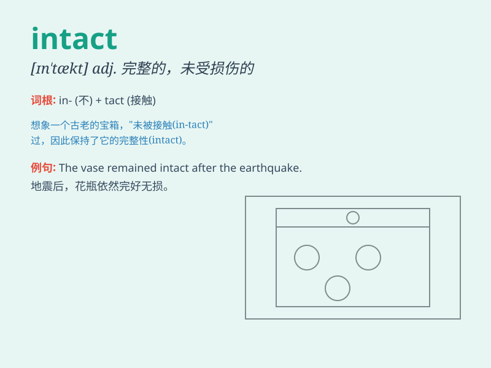

## intact

**英音:** _[ɪn\'tækt]_ **美音:** _[ɪn\'tækt]_

**译义:**
*adj.完整无缺的,尚未被人碰过的,(女子)保持童贞的,(家畜)未经阉割的*

### 短语

+ **remain intact:** _保持完整_

+ **intact forest:** _完整的森林_

+ **keep intact:** _保持不变；使完整_

+ **intact ecosystem:** _完整的生态系统_

+ **leave intact:** _使保持原样；保留完整_

### 例句

#### 例句1

> **The vase remained intact despite being dropped.**

**中文翻译:** 尽管花瓶被摔了，但它仍然完好无损。

**单词释义:** 完好无损的

#### 例句2

> **The ancient castle is still intact after centuries of wars.**

**中文翻译:** 这座古老的城堡在经历了几个世纪的战争后仍然完好无损。

**单词释义:** 完好无损的

#### 例句3

> **The ecosystem of this area has remained intact.**

**中文翻译:** 这个地区的生态系统一直保持完整。

**单词释义:** 完整的；未受损的

### 背诵小故事

>
想象一个古老的宝藏箱，经历了无数的风雨和探险者的寻找，但其内部的珍贵宝物依然
intact（完好无损）。就像这个宝藏箱，intact
表示未受损伤、完整无缺的意思。

**想象一个古老的宝藏箱，经历了很多但内部宝物依然完好无损，以此说明
intact 意思是未受损伤、完整无缺。**

### 图义

