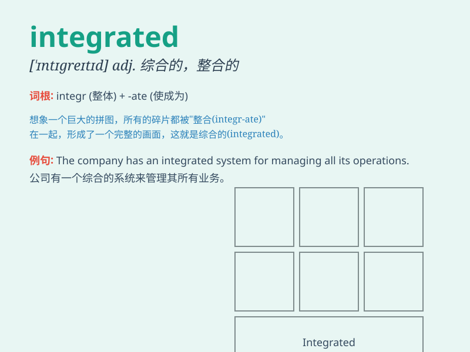

## integrated

**英音:** _[\'ɪntɪgreɪtɪd]_ **美音:** _[\'ɪntɪɡretɪd]_

**译义:** *adj.综合的,完整的*

### 短语

+ **integrated circuit:** _集成电路_

+ **integrated development:** _综合发展_

+ **integrated system:** _集成系统_

+ **fully integrated:** _完全集成_

+ **integrated approach:** _综合方法_

### 例句

#### 例句1

> **The integrated circuit has revolutionized the electronics
industry.**

**中文翻译:** 集成电路已经彻底改变了电子工业。

**单词释义:** 综合的；整合的

#### 例句2

> **This is an integrated approach to problem-solving.**

**中文翻译:** 这是解决问题的一种综合方法。

**单词释义:** 综合的；整体的

#### 例句3

> **The school has an integrated curriculum that combines different
subjects.**

**中文翻译:** 这所学校有一个综合课程，它结合了不同的学科。

**单词释义:** 综合的；融合的

### 背诵小故事

> Imagine a robot. Its parts were separate at first. But then, they
were all put together perfectly to form a whole. This process is like
\'integrated\'. It means to combine different things to form a whole
unit.

**想象一个机器人。它的部件起初是分开的。但后来，它们都完美地组合在了一起。这个过程就像'integrated'。它的意思是将不同的事物组合成一个整体。**

### 图义

