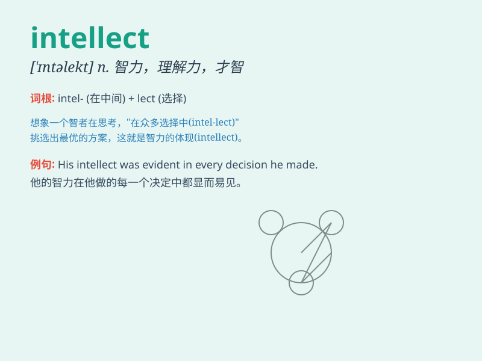

## intellect

**英音:** _[\'ɪntəlekt]_ **美音:** _[\'ɪntəlɛkt]_

**译义:** *n.智力*

### 短语

+ **keen intellect:** _敏锐的智力_

+ **superior intellect:** _卓越的智力_

+ **analytical intellect:** _分析性的智力_

+ **creative intellect:** _创造性的智力_

+ **intellect development:** _智力发展_

### 例句

#### 例句1

> **He is a man of great intellect.**

**中文翻译:** 他是一个极具才智的人。

**单词释义:** 才智；智力

#### 例句2

> **The task requires a high level of intellect.**

**中文翻译:** 这项任务需要高水平的智力。

**单词释义:** 智力

#### 例句3

> **Her intellect enables her to solve complex problems easily.**

**中文翻译:** 她的才智使她能轻松解决复杂的问题。

**单词释义:** 才智

### 背诵小故事

> 从前有个聪明的小孩，大家都称赞他有非凡的
intellect（智力）。他能快速解决难题，理解复杂的概念。他的 intellect
让他在学校和生活中都表现出色，成为大家学习的榜样。

**从前有个聪明的小孩，大家都称赞他有非凡的智力。他能快速解决难题，理解复杂的概念。他的智力让他在学校和生活中都表现出色，成为大家学习的榜样。**

### 图义

