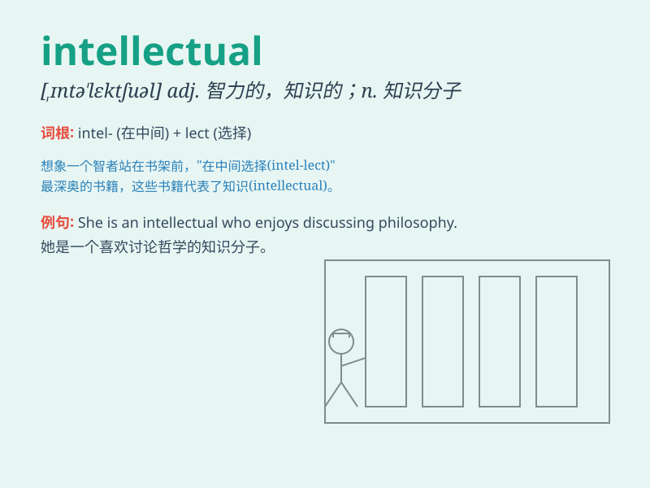

## intellectual

**英音:** _[,ɪntə\'lektʃʊəl; -tjʊəl]_ **美音:**
_[,ɪntə\'lɛktʃuəl]_

**译义:** *adj.智力的,有智力的,显示智力的n.知识分子*

### 短语

+ **intellectual property:** _知识产权_

+ **intellectual curiosity:** _求知欲_

+ **intellectual development:** _智力发展_

+ **intellectual elite:** _知识精英_

+ **intellectual work:** _脑力工作_

### 例句

#### 例句1

> **He is a well-known intellectual in the field of history.**

**中文翻译:** 他是历史领域一位著名的知识分子。

**单词释义:** 知识分子

#### 例句2

> **Intellectual pursuits such as reading and writing enrich our
minds.**

**中文翻译:** 诸如阅读和写作这样的智力追求丰富了我们的思想。

**单词释义:** 智力的；脑力的

#### 例句3

> **The conference attracted many intellectuals from around the
world.**

**中文翻译:** 这次会议吸引了来自世界各地的许多知识分子。

**单词释义:** 知识分子

### 背诵小故事

> A group of intellectuals were discussing complex theories in a
library. They had sharp minds and loved to explore new ideas. They were
the true intellectual power.

**一群知识分子在图书馆里讨论复杂的理论。他们头脑敏锐，喜欢探索新的想法。他们是真正的智力力量。**

### 图义

