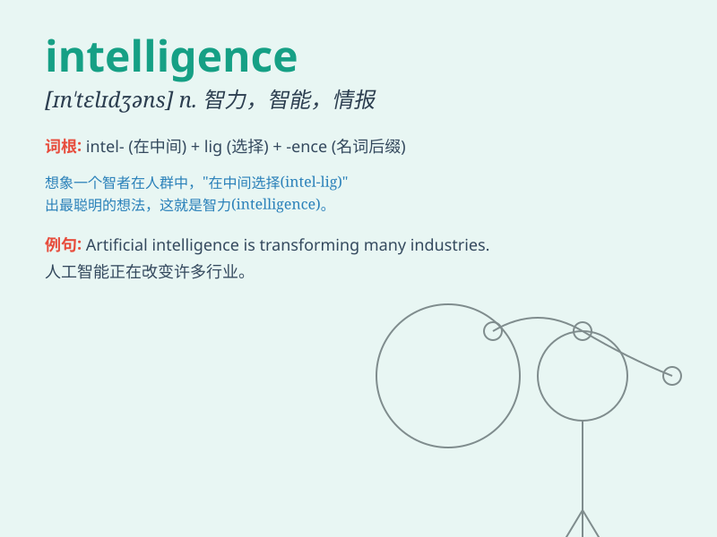

## intelligence

**英音:** _[ɪn\'telɪdʒ(ə)ns]_ **美音:**
_[ɪn\'tɛlɪdʒəns]_

**译义:** *n.智力,聪明,智能*

### 短语

+ **artificial intelligence:** _人工智能_

+ **intelligence quotient:** _智商_

+ **emotional intelligence:** _情商_

+ **intelligence agency:** _情报机构_

+ **military intelligence:** _军事情报_

### 例句

#### 例句1

> **She has remarkable intelligence and always gets top grades in
school.**

**中文翻译:** 她非常聪明，在学校总是取得顶尖的成绩。

**单词释义:** 智力；才智

#### 例句2

> **The intelligence report indicated a potential threat to national
security.**

**中文翻译:** 这份情报报告表明存在对国家安全的潜在威胁。

**单词释义:** 情报；谍报

#### 例句3

> **Artificial intelligence is transforming many industries.**

**中文翻译:** 人工智能正在改变许多行业。

**单词释义:** 智能

### 背诵小故事

> A spy was sent to gather intelligence. He sneaked into the enemy\'s
base, using his wits and skills to obtain crucial information. The
intelligence he collected helped his team win the battle.

**一名间谍被派去收集情报。他潜入敌人的基地，运用智慧和技能获取关键信息。他收集的情报帮助他的团队赢得了战斗。**

### 图义

