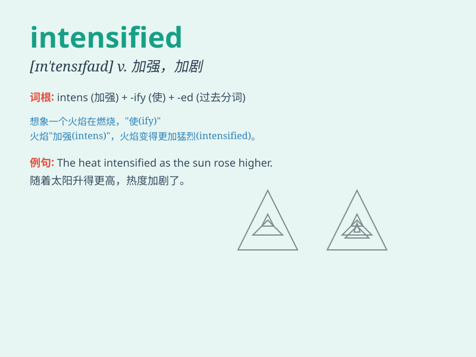

## intensified

**英音:** _null_ **美音:** _null_

**译义:** *null*

### 短语

+ **intensified training:** _强化训练_

+ **intensified competition:** _激烈的竞争_

+ **intensified efforts:** _加大努力_

+ **intensified security:** _加强安保_

+ **intensified emotion:** _强烈的情感_

### 例句

#### 例句1

> **The conflict intensified as more troops were deployed.**

**中文翻译:** 随着更多的部队被部署，冲突加剧了。

**单词释义:** 加剧，增强

#### 例句2

> **The rain intensified, making the roads slippery.**

**中文翻译:** 雨势加剧，使得道路变得湿滑。

**单词释义:** （使）增强，（使）加剧

#### 例句3

> **Her efforts intensified when she realized the importance of the
project.**

**中文翻译:** 当她意识到这个项目的重要性时，她的努力增强了。

**单词释义:** 增强，强化

### 背诵小故事

> A brave knight was on a quest. The challenges he faced intensified as
he went deeper into the forest. But his determination also intensified,
making him stronger. Finally, he achieved victory.

**一位勇敢的骑士正在执行一项任务。当他深入森林时，他面临的挑战加剧了。但他的决心也增强了，使他变得更强大。最终，他取得了胜利。**

### 图义

