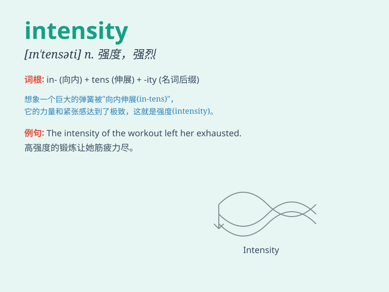

## intensity

**英音:** _[ɪn\'tensɪtɪ]_ **美音:** _[ɪn\'tɛnsəti]_

**译义:** *n.强烈,剧烈,强度 亮度*

### 短语

+ **light intensity:** _光强度_

+ **stress intensity:** _应力强度_

+ **intensity of emotion:** _情感的强度_

+ **sound intensity:** _声音强度_

+ **energy intensity:** _能源强度_

### 例句

#### 例句1

> **The intensity of the earthquake was measured at 7.0 on the
Richter scale.**

**中文翻译:** 这次地震的强度在里氏震级上被测量为 7.0 级。

**单词释义:** 强度；烈度

#### 例句2

> **She works with great intensity to meet the deadline.**

**中文翻译:** 她以极大的强度工作以赶上截止日期。

**单词释义:** 强度；力度

#### 例句3

> **The light has a high intensity, which is hurting my eyes.**

**中文翻译:** 这光强度很高，刺痛了我的眼睛。

**单词释义:** 强度；亮度

### 背诵小故事

> A brave explorer was searching for a lost treasure in a dark cave.
The light of his torch was weak, but the INTENSITY of his desire to find
the treasure was strong. It kept him going despite all difficulties.

**一位勇敢的探险家在黑暗的洞穴中寻找失落的宝藏。他手中火把的光很微弱，但他找到宝藏的渴望强度很大。这股强烈的渴望让他克服了所有困难继续前行。**

### 图义

