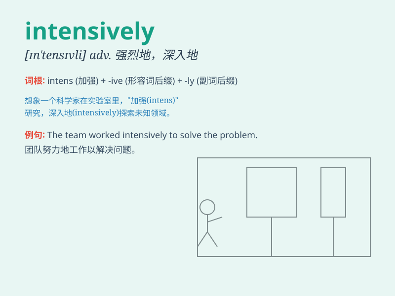

## intensively

**英音:** _[ɪn\'tensɪvli]_ **美音:** _[ɪn\'tensɪvli]_

**译义:** *adv.强烈地,集中地*

### 短语

+ **intensively cultivated:** _精耕细作的_

+ **intensively studied:** _深入研究的_

+ **intensively trained:** _强化训练的_

+ **intensively managed:** _精心管理的_

+ **intensively investigated:** _深入调查的_

### 例句

#### 例句1

> **The company is intensively researching new technologies to stay
competitive.**

**中文翻译:** 这家公司正在集中精力研究新技术以保持竞争力。

**单词释义:** 集中地；密集地

#### 例句2

> **She studied intensively for the exam and got excellent
grades.**

**中文翻译:** 她为考试集中学习并取得了优异的成绩。

**单词释义:** 集中地；高强度地

#### 例句3

> **The farmers are working intensively to harvest the crops before
the rain.**

**中文翻译:** 农民们正在加紧劳作，赶在下雨前收割庄稼。

**单词释义:** 加紧；密集地

### 背诵小故事

> A scientist worked intensively in the lab day and night. He focused
all his energy and time, conducting experiments non-stop. His intensive
efforts finally led to a major breakthrough.

**一位科学家在实验室里日夜高强度地工作。他集中了所有的精力和时间，不停地进行实验。他的高强度努力最终带来了重大突破。**

### 图义

