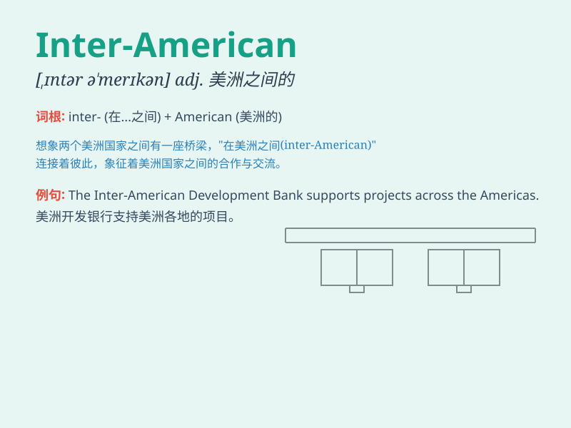

## Inter-American

**英音:** _[ˌɪntə(r) əˈmerɪkən]_ **美音:** _[ˌɪntər
əˈmerɪkən]_

**译义:** *adj. 美洲国家之间的；美洲各国间的*

### 短语

+ **Inter-American Development Bank:** _美洲开发银行_

+ **Inter-American Commission on Human Rights:** _美洲人权委员会_

+ **Inter-American Treaty of Reciprocal Assistance:**
_美洲国家间互助条约_

+ **Inter-American Conference:** _美洲国家会议_

+ **Inter-American System:** _美洲体系_

### 例句

#### 例句1

> **The Inter-American Development Bank provides financial support to
various projects.**

**中文翻译:** 美洲开发银行向各种项目提供财政支持。

**单词释义:** 美洲之间的

#### 例句2

> **The Inter-American Conference focused on regional
cooperation.**

**中文翻译:** 美洲间的会议侧重于区域合作。

**单词释义:** 美洲之间的

#### 例句3

> **Inter-American relations have become increasingly complex.**

**中文翻译:** 美洲之间的关系变得越来越复杂。

**单词释义:** 美洲之间的

### 背诵小故事

> Imagine a big meeting where people from America and other American
countries come together. This meeting is called Inter-American. It means
something related to or involving both America and other American
countries.

**想象有一个大型会议，来自美国和其他美洲国家的人们聚在一起。这个会议被称为"Inter-American"。它意味着与美国和其他美洲国家有关或涉及它们。**

### 图义

