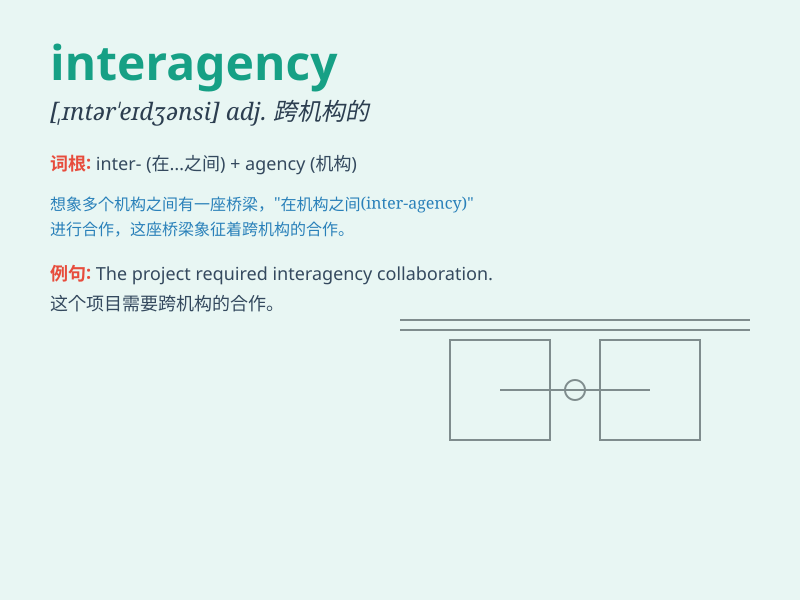

## interagency

**英音:** _[ˌɪntəˈrædʒənsi]_ **美音:**
_[ˌɪntərˈædʒənsi]_

**译义:** *adj. 在各机构之间的，涉及多个机构的*

### 短语

+ **interagency cooperation:** _跨部门合作_

+ **interagency communication:** _机构间沟通_

+ **interagency task force:** _跨机构工作小组_

+ **interagency agreement:** _跨部门协议_

+ **interagency coordination:** _机构间协调_

### 例句

#### 例句1

> **The interagency task force was established to address the complex
problem.**

**中文翻译:** 跨机构特别工作组的成立是为了解决这个复杂的问题。

**单词释义:** 跨机构的

#### 例句2

> **Interagency cooperation is crucial for the success of this
project.**

**中文翻译:** 跨机构合作对于这个项目的成功至关重要。

**单词释义:** 跨机构的

#### 例句3

> **The interagency meeting focused on improving communication and
coordination.**

**中文翻译:** 跨机构会议重点在于改善沟通和协调。

**单词释义:** 跨机构的

### 背诵小故事

> Imagine a big project where different agencies like the police, fire
department, and medical team need to work together. This cooperation
among agencies is called \'interagency\'.

**想象一个大项目，其中像警察局、消防队和医疗团队等不同机构需要共同工作。这种机构之间的合作就被称为'跨部门的；部门间的'。**

### 图义

