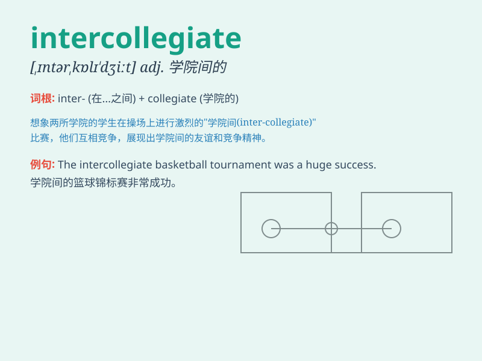

## intercollegiate

**英音:** _[,ɪntəkə\'liːdʒ(ɪ)ət]_ **美音:**
_[,ɪntɚkə\'lidʒɪət]_

**译义:** *adj.学院间的*

### 短语

+ **intercollegiate athletics:** _校际体育活动_

+ **intercollegiate competition:** _校际竞赛_

+ **intercollegiate debate:** _校际辩论_

+ **intercollegiate exchange:** _校际交流_

+ **intercollegiate tournament:** _校际锦标赛_

### 例句

#### 例句1

> **The intercollegiate debate competition was fiercely
contested.**

**中文翻译:** 校际辩论比赛竞争激烈。

**单词释义:** 校际的

#### 例句2

> **She participated in an intercollegiate sports event last
month.**

**中文翻译:** 她上个月参加了一个校际体育赛事。

**单词释义:** 校际的

#### 例句3

> **The intercollegiate music festival attracted many students.**

**中文翻译:** 校际音乐节吸引了许多学生。

**单词释义:** 校际的

### 背诵小故事

> Imagine a big sports event where teams from different colleges come
together to compete. This event is called \'intercollegiate\'. It means
happening or existing between colleges.

**想象一个大型体育赛事，来自不同学院的团队聚集在一起竞争。这个赛事就被称为'intercollegiate'。它的意思是在学院之间发生或存在的。**

### 图义

