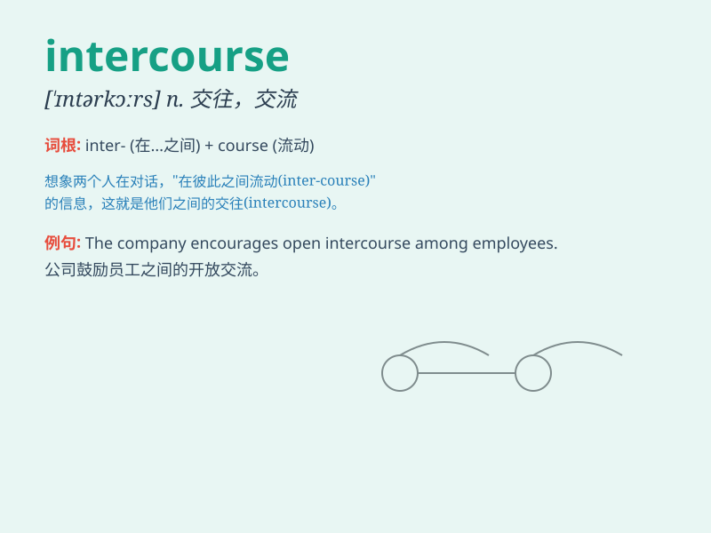

## intercourse

**英音:** _[\'ɪntəkɔːs]_ **美音:** _[\'ɪntɚkɔrs]_

**译义:** *n.交往,交流*

### 短语

+ **sexual intercourse:** _性交；性行为_

+ **social intercourse:** _社交；社会交往_

+ **commercial intercourse:** _商业往来；商务交流_

+ **intellectual intercourse:** _知识交流；思想交流_

+ **diplomatic intercourse:** _外交交往_

### 例句

#### 例句1

> **The intercourse between the two countries has been very frequent
recently.**

**中文翻译:** 最近这两个国家之间的交往非常频繁。

**单词释义:** 交往；交流

#### 例句2

> **Sexual intercourse is a private matter between consenting
adults.**

**中文翻译:** 性交是成年人之间自愿的私人事务。

**单词释义:** 性交

#### 例句3

> **They had a friendly intercourse during the meeting.**

**中文翻译:** 他们在会议期间进行了友好的交流。

**单词释义:** 交流

### 背诵小故事

> A king and a queen had frequent intercourse to discuss important
matters for their kingdom. This interaction was crucial for making good
decisions. Here, \'intercourse\' means communication and interaction.

**一位国王和王后经常进行交流以讨论他们王国的重要事务。这种相互交流对于做出好的决策至关重要。在这里，\'intercourse\'意思是交流和相互作用。**

### 图义

