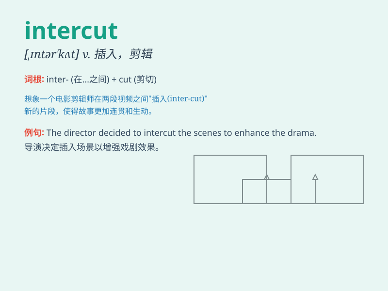

## intercut

**英音:** _[ɪntə\'kʌt]_ **美音:** _[,ɪntɚ\'kʌt]_

**译义:** *vt.使镜头交切vi.作镜头交切*

### 短语

+ **intercut scenes:** _交叉场景_

+ **intercut footage:** _交叉片段_

+ **intercut images:** _交叉图像_

+ **intercut sequences:** _交叉序列_

+ **intercut stories:** _交叉故事_

### 例句

#### 例句1

> **The film intercuts between the present and the past.**

**中文翻译:** 这部电影在现在和过去之间交替切换。

**单词释义:** 在\...之间交替切换

#### 例句2

> **The documentary intercuts scenes of the war with present-day
interviews.**

**中文翻译:** 这部纪录片把战争的场景和现今的采访相互穿插。

**单词释义:** 使相互穿插

#### 例句3

> **The music video intercuts footage of the band performing with
images of the city.**

**中文翻译:** 这个音乐视频把乐队表演的片段和城市的画面相互穿插。

**单词释义:** 穿插（片段、画面等）

### 背诵小故事

> In a movie production, the director decided to intercut scenes of a
thrilling car chase with moments of the hero\'s intense planning. This
means to insert or alternate one scene with another.

**在电影制作中，导演决定将刺激的汽车追逐场景和英雄紧张策划的时刻相互穿插。这意味着插入或交替一个场景与另一个场景。**

### 图义

