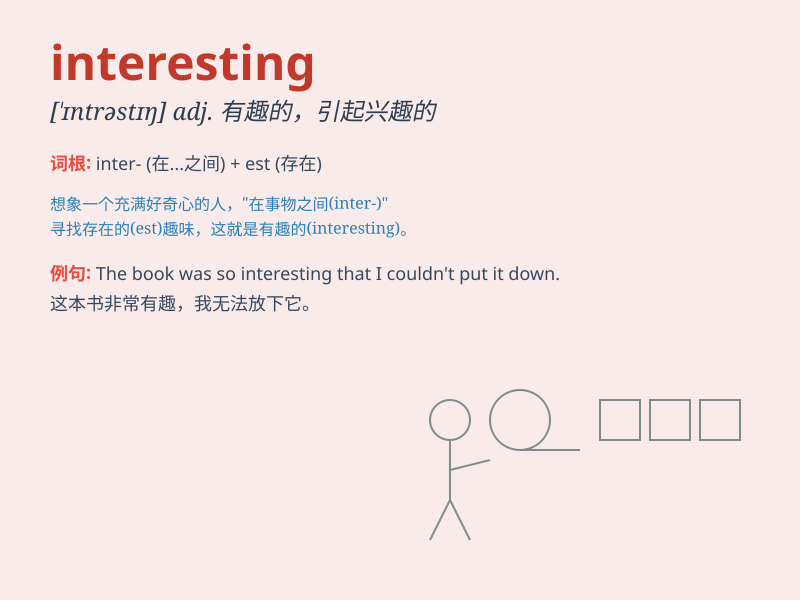

## interesting

**英音:** _[ˈɪntrəstɪŋ]_ **美音:** _[\'ɪntrəstɪŋ]_

**译义:** *adj.有趣味的,引起好奇(或注意)的*

### 短语

+ **be interesting in:** _对\...\...感兴趣_

+ **find something interesting:** _发现有趣的东西_

+ **an interesting story:** _一个有趣的故事_

+ **interesting places:** _有趣的地方_

+ **interesting people:** _有趣的人_

### 例句

#### 例句1

> **This book is very interesting.**

**中文翻译:** 这本书非常有趣。

**单词释义:** 有趣的

#### 例句2

> **The story he told was interesting.**

**中文翻译:** 他讲的故事很有趣。

**单词释义:** 有趣的

#### 例句3

> **It\'s an interesting idea.**

**中文翻译:** 这是个有趣的想法。

**单词释义:** 有趣的

### 背诵小故事

> One day, I went to a zoo. There I saw many strange animals. The
monkeys were jumping around, which was very interesting. I couldn\'t
take my eyes off them. It was such an enjoyable experience.

**有一天，我去了动物园。在那里我看到了很多奇怪的动物。猴子们到处蹦跳，这非常有趣。我的眼睛一刻都离不开它们。这是一次非常愉快的经历。**

### 图义

