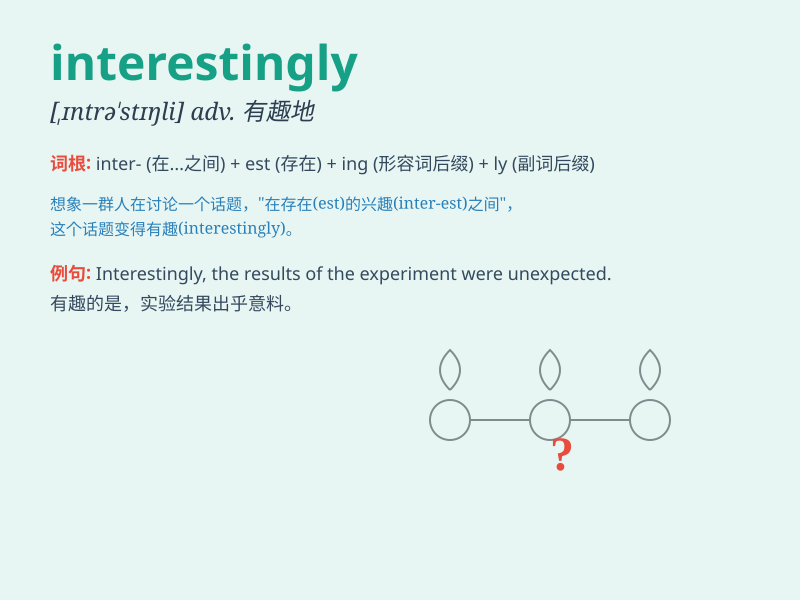

## interestingly

**英音:** _[\'ɪntrəstɪŋlɪ]_ **美音:** _[\'ɪntrəstɪŋlɪ]_

**译义:** *adv.有趣地*

### 短语

+ **interestingly enough:** _有趣的是；说来也怪_

+ **interestingly different:** _有趣的不同_

+ **interestingly similar:** _有趣的相似_

+ **interestingly new:** _有趣的新_

+ **interestingly old:** _有趣的旧_

### 例句

#### 例句1

> **Interestingly, she decided to change her career path at the age
of 40.**

**中文翻译:** 有趣的是，她在 40 岁时决定改变自己的职业道路。

**单词释义:** 有趣地；令人关注地

#### 例句2

> **Interestingly, the book became a bestseller within a month.**

**中文翻译:** 有趣的是，这本书在一个月内就成了畅销书。

**单词释义:** 有趣地；令人关注地

#### 例句3

> **Interestingly, he didn\'t show any signs of nervousness before
the exam.**

**中文翻译:** 有趣的是，他在考试前没有表现出任何紧张的迹象。

**单词释义:** 有趣地；令人关注地

### 背诵小故事

> A group of friends were exploring a mysterious cave. Interestingly,
they found a hidden treasure chest. This unexpected discovery made their
adventure even more exciting.

**一群朋友正在探索一个神秘的洞穴。有趣的是，他们发现了一个隐藏的宝箱。这个意外的发现让他们的冒险更加令人兴奋。**

### 图义

