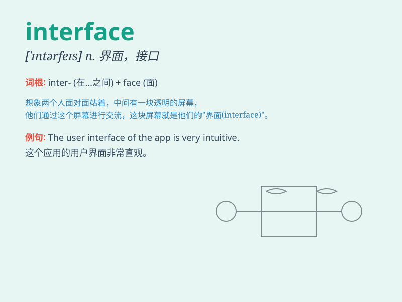

## interface

**英音:** _[\'ɪntəfeɪs]_ **美音:** _[\'ɪntɚ\'fes]_

**译义:** *n.[地质]分界面,接触面,[物、化]界面*

### 短语

+ **user interface:** _用户界面_

+ **graphical interface:** _图形界面_

+ **interface design:** _界面设计_

+ **network interface:** _网络接口_

+ **interface card:** _接口卡_

### 例句

#### 例句1

> **The user interface of this software is very intuitive.**

**中文翻译:** 这款软件的用户界面非常直观。

**单词释义:** 界面

#### 例句2

> **The new system has a better interface with the existing
infrastructure.**

**中文翻译:** 新系统与现有的基础设施有更好的接口。

**单词释义:** 接口

#### 例句3

> **He has to interface with clients on a daily basis.**

**中文翻译:** 他每天都得和客户打交道。

**单词释义:** 交流；联系

### 背诵小故事

>
想象一个电脑和打印机，它们之间需要连接才能工作。这个连接的地方就是\'interface\'，就像两个不同的世界在此交汇、交流。电脑通过这个界面向打印机发送指令，打印机接收并执行。

**想象电脑和打印机的连接之处来理解\'interface\'这个单词，意为界面、接口**

### 图义

