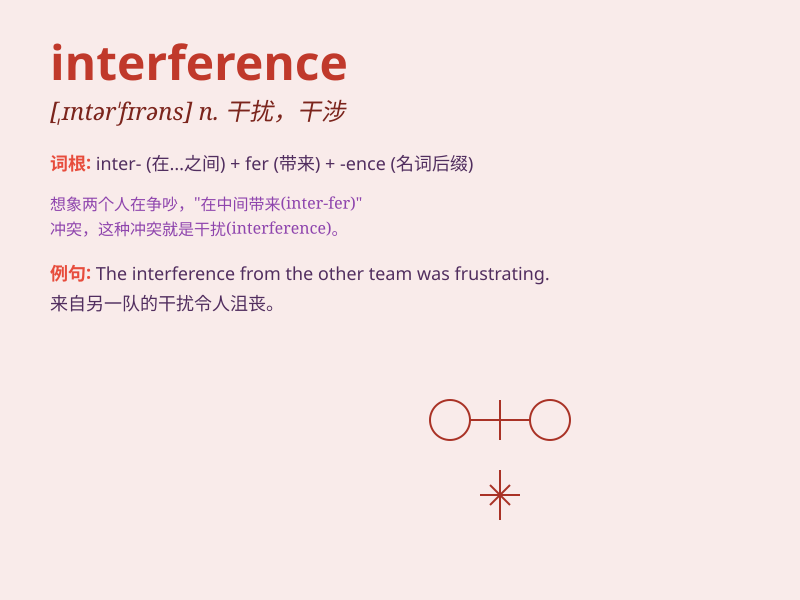

## interference

**英音:** _[ɪntə\'fɪər(ə)ns]_ **美音:**
_[,ɪntɚ\'fɪrəns]_

**译义:** *n.冲突,干涉*

### 短语

+ **electromagnetic interference:** _电磁干扰_

+ **radio interference:** _无线电干扰_

+ **interference pattern:** _干涉图样_

+ **interference fit:** _过盈配合_

+ **optical interference:** _光学干涉_

### 例句

#### 例句1

> **The government\'s interference in the economy has caused some
controversy.**

**中文翻译:** 政府对经济的干预引起了一些争议。

**单词释义:** 干预

#### 例句2

> **I don\'t like any interference when I\'m working.**

**中文翻译:** 我工作时不喜欢任何干扰。

**单词释义:** 干扰

#### 例句3

> **His interference ruined our plan.**

**中文翻译:** 他的干涉毁了我们的计划。

**单词释义:** 干涉

### 背诵小故事

>
想象在一场重要的足球比赛中，裁判不断地打断球员（interference），吹哨判罚，干扰了比赛的正常进行。球员们很无奈，因为裁判的这种干涉让他们无法尽情发挥。

**想象在足球比赛中裁判的打断干扰，来记住'interference'这个表示干涉、干扰的单词**

### 图义

