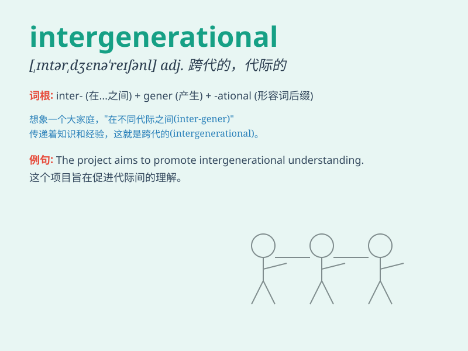

## intergenerational

**英音:** _[,ɪntədʒenə\'reɪʃ(ə)n(ə)l]_ **美音:**
_[,ɪntɚdʒɛnə\'reʃənl]_

**译义:** *adj.两代间的*

### 短语

+ **intergenerational conflict:** _代际冲突_

+ **intergenerational equity:** _代际公平_

+ **intergenerational mobility:** _代际流动_

+ **intergenerational transmission:** _代际传递_

+ **intergenerational justice:** _代际正义_

### 例句

#### 例句1

> **Intergenerational conflicts often arise due to differences in
values and experiences.**

**中文翻译:** 由于价值观和经历的不同，代际冲突经常出现。

**单词释义:** 代际之间的

#### 例句2

> **The study focuses on intergenerational mobility in income and
social status.**

**中文翻译:** 这项研究关注收入和社会地位方面的代际流动。

**单词释义:** 代际的

#### 例句3

> **Intergenerational equity is an important issue in sustainable
development.**

**中文翻译:** 代际公平是可持续发展中的一个重要问题。

**单词释义:** 代际的

### 背诵小故事

> Imagine a big family reunion. Grandparents, parents, and kids are all
there. The problems and joys they share across these generations is what
\'intergenerational\' means. It\'s about connections and differences
between different age groups.

**想象一个大型的家庭聚会。祖父母、父母和孩子们都在。他们跨越这些代际所分享的问题和快乐就是"intergenerational（代际的）"的含义。它是关于不同年龄组之间的联系和差异。**

### 图义

