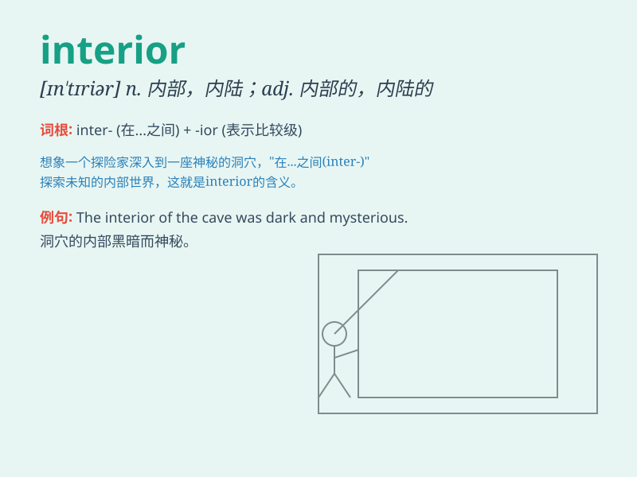

## interior

**英音:** _[ɪn\'tɪɜːrɪə]_ **美音:** _[ɪn\'tɪrɪɚ]_

**译义:** *adj.内部的,内的n.内部*

### 短语

+ **interior design:** _室内设计_

+ **interior decoration:** _室内装潢_

+ **interior minister:** _内政部长_

+ **interior angle:** _内角_

+ **interior lighting:** _室内照明_

### 例句

#### 例句1

> **The interior of the house was beautifully decorated.**

**中文翻译:** 这所房子的内部装饰得很漂亮。

**单词释义:** 内部；里面

#### 例句2

> **The car has a luxurious interior.**

**中文翻译:** 这辆汽车内部很豪华。

**单词释义:** 内部；里面

#### 例句3

> **He is an expert on interior design.**

**中文翻译:** 他是室内设计方面的专家。

**单词释义:** 室内的；内部的

### 背诵小故事

>
想象你走进一座古老的城堡，穿过大门，你看到的城堡内部的房间、走廊和装饰，这就是\'interior\'。城堡的内部充满神秘，让你想要一探究竟。

**想象走进城堡内部的情景来辅助记忆\'interior\'这个单词，意思是内部、内地、内政**

### 图义

