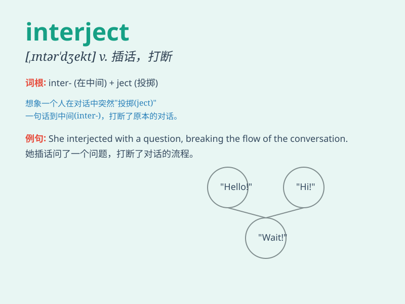

## interject

**英音:** _[,ɪntə\'dʒekt]_ **美音:** _[,ɪntɚ\'dʒɛkt]_

**译义:** *vt.插嘴,突然插入*

### 短语

+ **interject a comment:** _插入评论_

+ **interject suddenly:** _突然插话_

+ **interject humorously:** _幽默地插嘴_

+ **interject frequently:** _频繁插话_

+ **interject appropriately:** _恰当地插嘴_

### 例句

#### 例句1

> **He kept interrupting and interjecting his opinions.**

**中文翻译:** 他不停地打断并插入他的意见。

**单词释义:** 突然插入；插话

#### 例句2

> **During the meeting, she interjected a few relevant questions.**

**中文翻译:** 在会议期间，她插入了几个相关的问题。

**单词释义:** 插话；突然发言

#### 例句3

> **The teacher was explaining the lesson when a student interjected
with a comment.**

**中文翻译:** 老师正在讲解课程时，一个学生插了一句评论。

**单词释义:** 插嘴；打断（讲话）

### 背诵小故事

> In a heated debate, Tom was constantly expressing his opinions. But
when Mary started to speak, Tom would interject, interrupting her. It
made Mary quite annoyed.

**在一场激烈的辩论中，汤姆一直在表达自己的观点。但当玛丽开始说话时，汤姆会插话打断她。这让玛丽很恼火。**

### 图义

