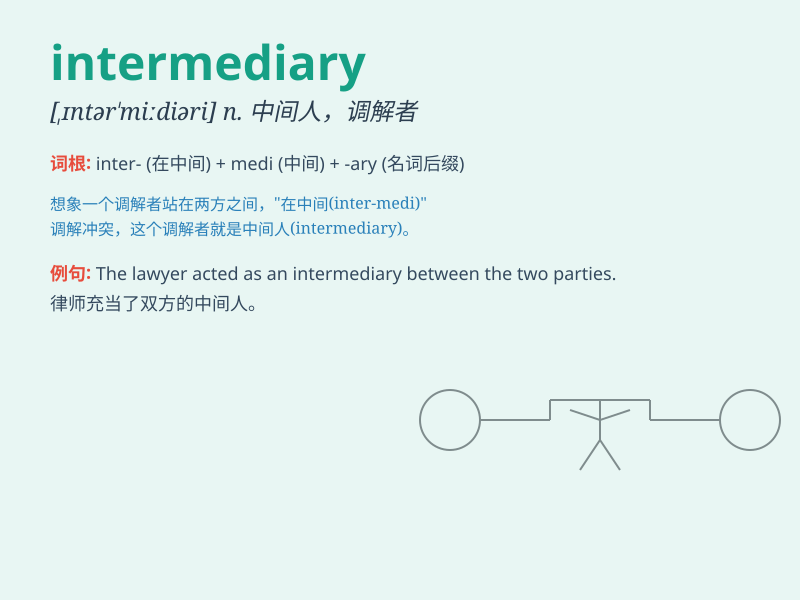

## intermediary

**英音:** _[,ɪntə\'miːdɪərɪ]_ **美音:**
_[,ɪntɚ\'midɪɛri]_

**译义:** *n.仲裁者,调解者,中间物adj.中间的,媒介的*

### 短语

+ **financial intermediary:** _金融中介机构_

+ **intermediary services:** _中介服务_

+ **intermediary stage:** _中间阶段_

+ **intermediary trade:** _中介贸易_

+ **intermediary agent:** _中介代理_

### 例句

#### 例句1

> **The lawyer acted as an intermediary between the two parties.**

**中文翻译:** 这位律师充当了双方之间的中间人。

**单词释义:** 中间人；调解人

#### 例句2

> **The company uses an intermediary to handle its overseas
sales.**

**中文翻译:** 这家公司使用一个中介机构来处理其海外销售业务。

**单词释义:** 中介；媒介

#### 例句3

> **She played the role of an intermediary in resolving the
conflict.**

**中文翻译:** 她在解决冲突中扮演了调解人的角色。

**单词释义:** 调解人；中间人

### 背诵小故事

> 想象一个人在买卖双方之间，像一座桥梁，协调着双方的交易。这个人就是
intermediary。他既不是买方也不是卖方，而是中间的协调者，促成双方达成满意的结果。

**想象一个在买卖双方之间充当桥梁、协调交易的中间人，以此来记住
intermediary 这个单词，意为中间人、中介**

### 图义

