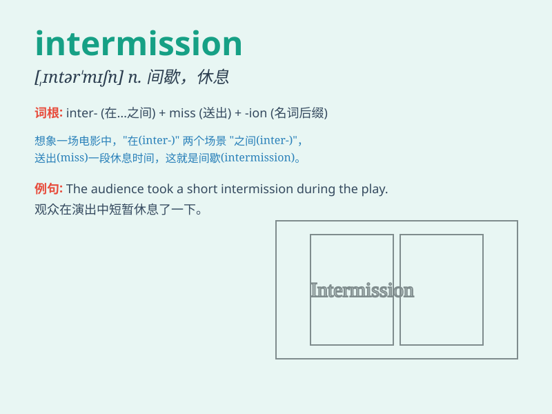

## intermission

**英音:** _[ɪntə\'mɪʃ(ə)n]_ **美音:** _[ˌɪntɚˈmɪʃən]_

**译义:** *n.间断*

### 短语

+ **intermission break:** _中场休息_

+ **short intermission:** _短暂的间歇_

+ **intermission period:** _间歇期_

+ **during intermission:** _在间歇期间_

+ **intermission time:** _间歇时间_

### 例句

#### 例句1

> **There was a short intermission between the two acts of the
play.**

**中文翻译:** 在这部戏的两幕之间有一个短暂的幕间休息。

**单词释义:** 幕间休息；暂停；间歇

#### 例句2

> **After an intermission of two years, she resumed her studies.**

**中文翻译:** 中断了两年之后，她重新开始了学业。

**单词释义:** 中断；停歇

#### 例句3

> **The intermission in the meeting gave everyone a chance to stretch
and relax.**

**中文翻译:** 会议中的间歇给了每个人伸展和放松的机会。

**单词释义:** 间歇；停顿

### 背诵小故事

>
想象一场精彩的戏剧，观众们正沉浸其中。突然，灯光暗下，舞台静止，这就是
intermission
。它意味着中场休息，就像演员们累了需要暂停，观众也能趁机放松一下。

**想象一场戏剧中的中场休息来理解【intermission】这个单词，意思是中场休息、暂停**

### 图义

