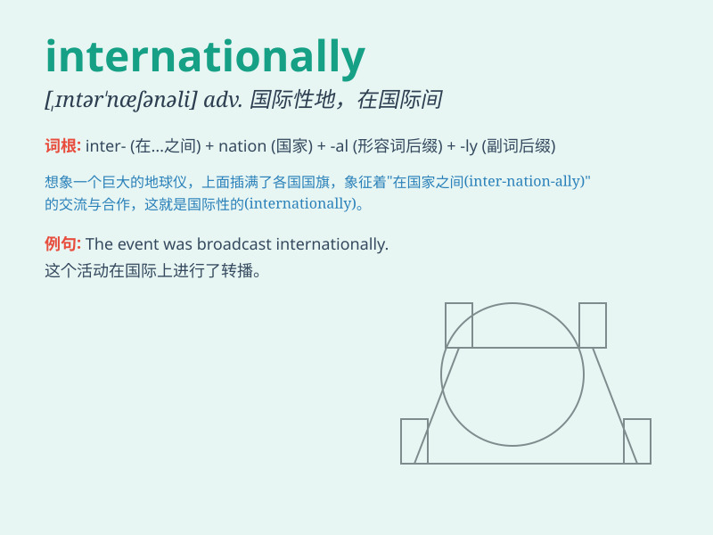

## internationally

**英音:** _[ˌɪntə(ː)ˈnæʃənli]_ **美音:**
_[ˌɪntərˈnæʃənəli]_

**译义:** *adv.国际性地,在国际间*

### 短语

+ **internationally renowned:** _国际知名的_

+ **internationally recognized:** _国际认可的_

+ **internationally competitive:** _具有国际竞争力的_

+ **internationally famous:** _国际著名的_

+ **internationally applicable:** _国际适用的_

### 例句

#### 例句1

> **The company is known internationally for its high-quality
products.**

**中文翻译:** 这家公司因其高质量的产品在国际上闻名。

**单词释义:** 在国际上

#### 例句2

> **She has performed internationally and received wide acclaim.**

**中文翻译:** 她在国际上演出并获得了广泛的赞誉。

**单词释义:** 在国际上

#### 例句3

> **Internationally, many countries are working together to address
climate change.**

**中文翻译:** 在国际上，许多国家正在共同努力应对气候变化。

**单词释义:** 在国际上

### 背诵小故事

> A young scientist\'s discovery was recognized internationally. People
from all over the world came to learn. This made the scientist realize
the importance of working on something that could benefit everyone
globally.

**一位年轻科学家的发现得到了国际认可。来自世界各地的人们都前来学习。这让这位科学家意识到从事能让全球每个人受益的工作的重要性。**

### 图义

