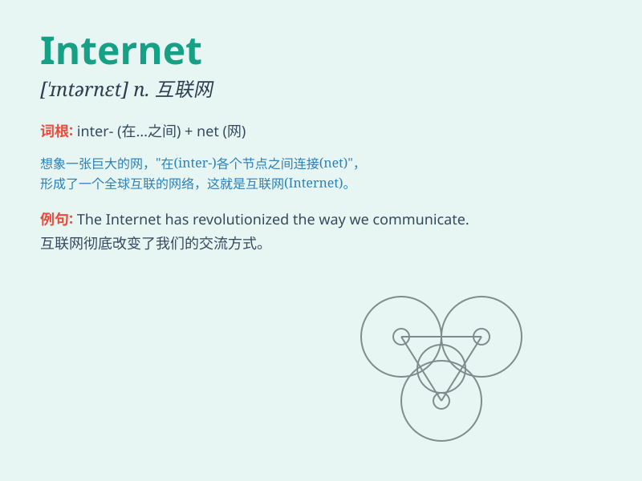

## Internet

**英音:** _[ˈɪntənet]_ **美音:** _[ˈɪntərnet]_

**译义:** *n. 因特网，互联网*

### 短语

+ **Internet access:** _互联网接入；网络接入_

+ **Internet café:** _网吧_

+ **Internet Explorer:** _（微软公司的）IE 浏览器_

+ **Internet Protocol:** _互联网协议_

+ **surf the Internet:** _上网；网上冲浪_

### 例句

#### 例句1

> **The Internet has changed the way we communicate.**

**中文翻译:** 互联网已经改变了我们交流的方式。

**单词释义:** 互联网

#### 例句2

> **I often search for information on the Internet.**

**中文翻译:** 我经常在互联网上搜索信息。

**单词释义:** 互联网

#### 例句3

> **With the development of the Internet, online shopping has become
more and more popular.**

**中文翻译:** 随着互联网的发展，网上购物变得越来越流行。

**单词释义:** 互联网

### 背诵小故事

> Once upon a time, people were isolated and had limited knowledge. But
then came the Internet, like a magic bridge connecting everyone. With
it, we can share, learn, and communicate easily, making the world
smaller and more accessible.

**从前，人们彼此孤立，知识有限。但后来出现了互联网，就像一座神奇的桥梁连接着每个人。有了它，我们可以轻松地分享、学习和交流，让世界变得更小、更容易接近。**

### 图义

