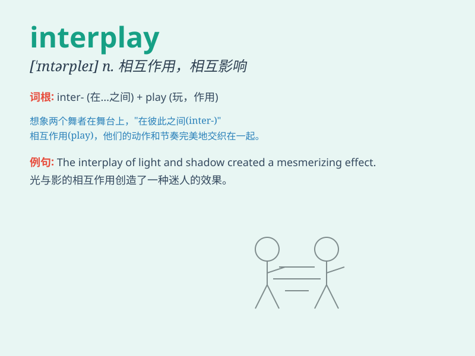

## interplay

**英音:** _[\'ɪntəpleɪ]_ **美音:** _[,ɪntɚ\'plɛi]_

**译义:** *v.相互影响n.相互影响*

### 短语

+ **interplay of forces:** _力量的相互作用_

+ **interplay between factors:** _因素之间的相互作用_

+ **complex interplay:** _复杂的相互作用_

+ **interplay of light and shadow:** _光与影的相互作用_

+ **the interplay of emotions:** _情绪的相互作用_

### 例句

#### 例句1

> **The interplay of light and shadow creates a dramatic effect in
the painting.**

**中文翻译:** 光与影的相互作用在这幅画中营造出了戏剧性的效果。

**单词释义:** 相互作用

#### 例句2

> **The interplay between supply and demand determines the price of
goods.**

**中文翻译:** 供求之间的相互作用决定了商品的价格。

**单词释义:** 相互作用

#### 例句3

> **There is a complex interplay of emotions in her decision-making
process.**

**中文翻译:** 在她的决策过程中存在着复杂的情感相互作用。

**单词释义:** 相互作用

### 背诵小故事

> Imagine a stage where music and dance interplay. The musicians play
beautiful notes, and the dancers move gracefully. Their performances
enhance each other, creating a wonderful show. This is like the meaning
of \'interplay\' - the interaction and mutual influence between things.

**想象一个舞台，音乐和舞蹈相互作用。音乐家演奏美妙的音符，舞者优雅地移动。他们的表演相互增色，创造出一场精彩的演出。这就像'interplay'的意思------事物之间的相互作用和相互影响。**

### 图义

