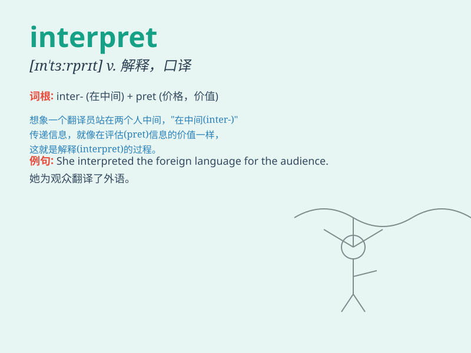

## interpret

**英音:** _[ɪn\'tɜːprɪt]_ **美音:** _[ɪn\'tɝprɪt]_

**译义:** *v.解释,说明,口译,通译,认为是\...的意思*

### 短语

+ **interpret as:** _把......理解为_

+ **interpret for:** _为......口译_

+ **interpret from:** _根据......解释_

+ **difficult to interpret:** _难以解释_

+ **freely interpret:** _自由解释_

### 例句

#### 例句1

> **The artist interpreted the theme of love in her latest
painting.**

**中文翻译:** 这位艺术家在她的最新画作中诠释了爱的主题。

**单词释义:** 诠释；解释

#### 例句2

> **She interpreted his silence as a sign of disapproval.**

**中文翻译:** 她把他的沉默理解为不赞成的表示。

**单词释义:** 理解；领会

#### 例句3

> **The law can be interpreted in different ways.**

**中文翻译:** 这部法律可以有不同的解释。

**单词释义:** 解释；说明

### 背诵小故事

> A detective was trying to interpret the mysterious symbols at the
crime scene. He thought hard and finally understood their meaning,
solving the case. Here, \'interpret\' means to explain the meaning of
something difficult to understand.

**一位侦探试图解读犯罪现场的神秘符号。他努力思考，最终明白了它们的含义，破获了案件。在这里，\'interpret\'意思是解释难以理解的事物的含义。**

### 图义

