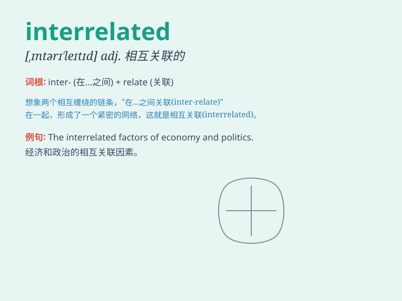

## interrelated

**英音:** _[,ɪntərɪ\'leɪtɪd]_ **美音:**
_[ˌɪntərɪˈleɪtɪd]_

**译义:** *adj.相关的*

### 短语

+ **interrelated factors:** _相互关联的因素_

+ **interrelated systems:** _相互关联的系统_

+ **interrelated concepts:** _相互关联的概念_

+ **interrelated events:** _相互关联的事件_

+ **interrelated processes:** _相互关联的过程_

### 例句

#### 例句1

> **The economy and the environment are interrelated.**

**中文翻译:** 经济和环境是相互关联的。

**单词释义:** 相互关联的

#### 例句2

> **All these issues are interrelated and cannot be dealt with
separately.**

**中文翻译:** 所有这些问题都是相互关联的，不能分开处理。

**单词释义:** 相互关联的

#### 例句3

> **The various factors in this problem are closely interrelated.**

**中文翻译:** 这个问题中的各种因素紧密地相互关联。

**单词释义:** 相互关联的

### 背诵小故事

> Imagine a big family tree. Each member is interrelated. Like a
brother and sister, they have connections and influences on each other.
Just like that, things that are interrelated have close links and depend
on one another.

**想象一棵大大的家族树。每个成员都是相互关联的。就像兄弟姐妹一样，他们彼此有联系和影响。就像这样，相互关联的事物有着紧密的联系并且相互依赖。**

### 图义

