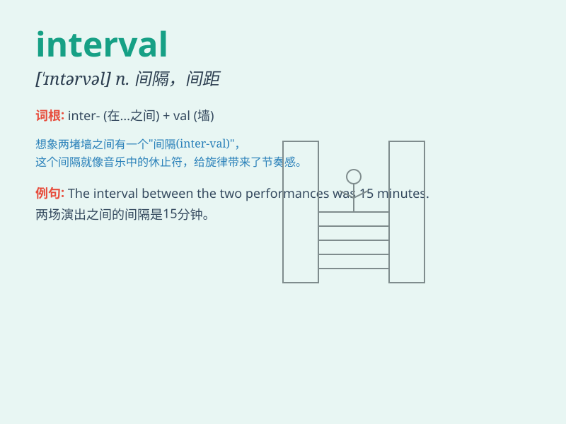

## interval

**英音:** _[\'ɪntəv(ə)l]_ **美音:** _[\'ɪntɚvl]_

**译义:** *n.间隔,距离,幕间休息n.时间间隔*

### 短语

+ **time interval:** _时间间隔_

+ **at intervals:** _不时；相隔一定距离_

+ **interval training:** _间歇训练_

+ **sampling interval:** _采样间隔_

+ **confidence interval:** _置信区间_

### 例句

#### 例句1

> **The interval between the two meetings was two weeks.**

**中文翻译:** 两次会议之间的间隔是两周。

**单词释义:** 间隔；间距

#### 例句2

> **She took intervals of rest during the long hike.**

**中文翻译:** 在长途徒步旅行中，她不时休息。

**单词释义:** 间歇；停顿

#### 例句3

> **The music has regular intervals of silence.**

**中文翻译:** 这首音乐有规律的静音间隔。

**单词释义:** 间隔；间隙

### 背诵小故事

>
想象一下，你在跑马拉松，每跑一段固定的距离，就会有一个休息点。这个休息点之间的距离就是\'interval\'。就像你在努力过程中的短暂停歇和间隔。

**想象在跑马拉松时，固定距离的休息点之间的距离就是'间隔；间距；幕间休息'**

### 图义

