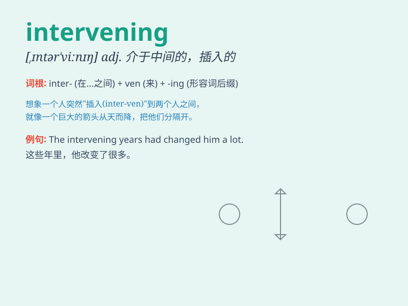

## intervening

**英音:** _[ˌɪntərˈviː.nɪŋ]_ **美音:**
_[ˌɪn.tərˈvi.nɪŋ]_

**译义:** *adj. 干预的；介入的；在两者之间的*

### 短语

+ **intervening period:** _中间时期；过渡时期_

+ **intervening space:** _中间空间；间隔空间_

+ **intervening variable:** _中介变量；干预变量_

+ **intervening years:** _中间的几年；其间的岁月_

+ **intervening event:** _介入事件；中间事件_

### 例句

#### 例句1

> **The intervening years had been kind to her.**

**中文翻译:** 中间的这些年她过得不错。

**单词释义:** 中间的

#### 例句2

> **There were no significant differences in the intervening
period.**

**中文翻译:** 在中间这段时期没有显著的差异。

**单词释义:** 中间的

#### 例句3

> **He had trouble remembering what happened in the intervening
months.**

**中文翻译:** 他很难记起中间几个月发生了什么。

**单词释义:** 中间的

### 背诵小故事

> A brave knight was on a journey. When he saw a village being attacked
by bandits, he decided to intervene. The intervening knight saved the
villagers and became a hero.

**一位勇敢的骑士正在旅行。当他看到一个村庄被强盗袭击时，他决定介入。介入的骑士拯救了村民，并成为了英雄。**

### 图义

