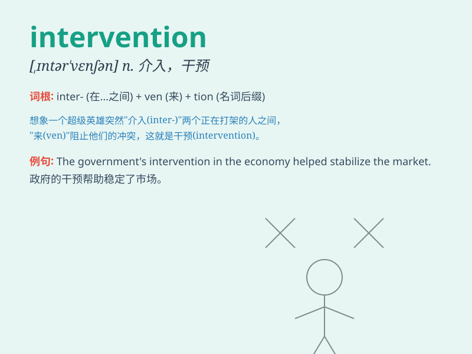

## intervention

**英音:** _[ɪntə\'venʃ(ə)n]_ **美音:** _[,ɪntɚ\'vɛnʃən]_

**译义:** *n.干涉*

### 短语

+ **military intervention:** _军事干预_

+ **government intervention:** _政府干预_

+ **judicial intervention:** _司法干预_

+ **preventive intervention:** _预防性干预_

+ **economic intervention:** _经济干预_

### 例句

#### 例句1

> **The government\'s intervention in the economy was aimed at
stabilizing prices.**

**中文翻译:** 政府对经济的干预旨在稳定物价。

**单词释义:** 干预；介入

#### 例句2

> **His intervention saved the project from failure.**

**中文翻译:** 他的介入使这个项目免于失败。

**单词释义:** 介入；插手

#### 例句3

> **We need to minimize outside intervention in our personal
affairs.**

**中文翻译:** 我们需要尽量减少外界对我们个人事务的干预。

**单词释义:** 干预；干涉

### 背诵小故事

> A city was in chaos due to a natural disaster. Just when people were
desperate, the government\'s intervention came. They provided food,
shelter and medical care, saving the city. \'Intervention\' means coming
in to change a situation.

**一个城市因自然灾害陷入混乱。就在人们绝望之时，政府的介入到来了。他们提供食物、住所和医疗救助，拯救了这座城市。\'Intervention\'意思是介入以改变某种状况。**

### 图义

